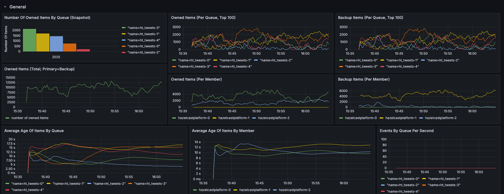
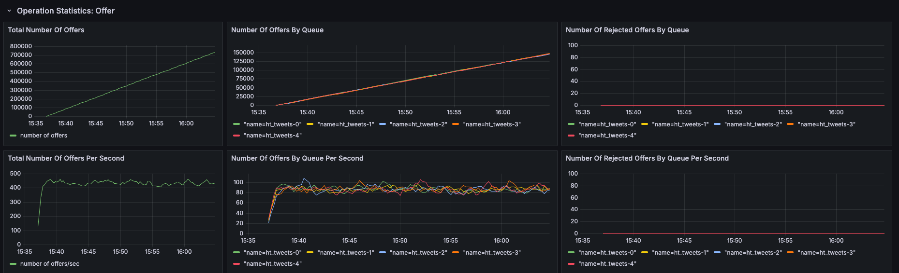
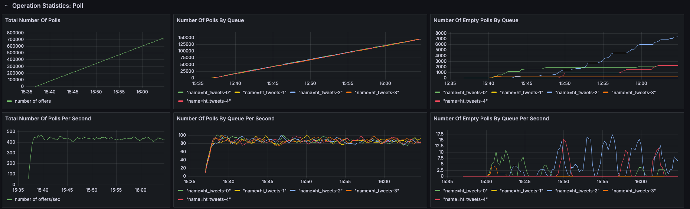
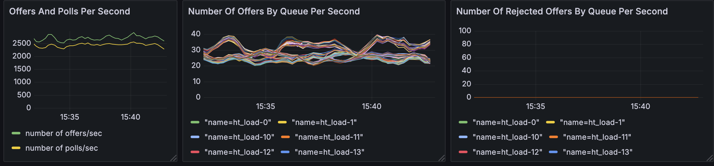
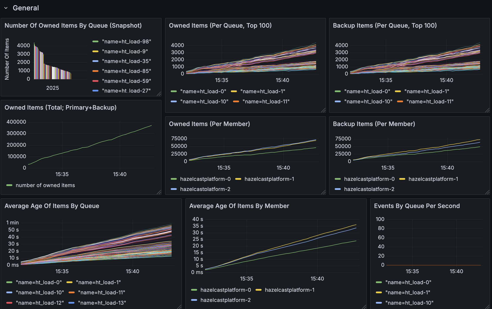

# Hazeltest

_Disclaimer: What you're about to read is not AI-generated, but created by a human being -- one made of flesh and bone, one who continuously thrives to aim upward (but sometimes struggles to act accordingly), and one who occasionally consumes way too much caffeine (the human being in question stopped counting the cups of coffee it drank while writing this article, but is pretty certain that number would be beyond staggering.) Also, the human author of the following sections hopes you find them useful and, perhaps, even a little entertaining._

Welcome, fellow Hazelcast warrior! Maybe you're taking a look at this repository because you've been facing the challenge of load-testing your Hazelcast clusters, and perhaps you've been wondering whether there are tools out there in the depths of this thing called the _Internet_ that can support you on this journey.

## Application Purpose
Short disclaimer: If you're more the visual type of person and would much rather digest a video than read text, then the [introduction video for Hazeltest](https://youtu.be/GojMTeDzdsk?si=xh-6P6Vk15UdjWCb) might be for you!

On the other hand, in case you like _reading_ stuff -- you know, how our grandfathers did --, then... well, read on.

Hazeltest is a small application whose purpose is to support Hazelcast operation engineers in load-testing the Hazelcast clusters described by their release candidates (where the _release candidate_ is the package bundling the Hazelcast Platform executable plus all configuration to make it fly that might eventually make it to production, such as a Helm chart). Along those lines, the application offers simple-to-configure, yet effective and versatile runners you can utilize to create load on the Hazelcast cluster under test, so errors such as misconfigurations make themselves known in a safe testing environment -- that is, _long before the release candidate describing this cluster makes its way to production_, where such errors could wreak all kinds of havoc!

Keep in mind that you don't really have a choice _if_ your Hazelcast clusters get load-tested; you can only choose _when_ -- after all, in the absence of any formal load-testing prior to shipping a release candidate to production, it's the production environment itself that will necessarily conduct the first load test, because it will be the first stage in which the release candidate -- now actually released -- gets exposed to load, which it must then handle. So, if load testing is necessarily performed anyway, then why not adjust the _when_ bit to a point in the release cycle in which the release candidate can be load-tested to your heart's content in a safe environment, such as a dedicated load-testing environment? 

Even if running an exhaustive and thorough load test on a Hazelcast cluster does not make misconfigurations manifest, it may still uncover potential for improvement in terms of the members' performance, which you can then address before shipping the release candidate in question to production. And in case neither errors nor improvement potentials make themselves known, then, well, you've got proof that your release candidate is ready to go, and you brought about that proof long before the release candidate actually got shipped to production! (In my humble opinion, bringing that proof _before_ rolling out the thing to production just makes for so much better sleep at night, specifically when your production Hazelcast clusters run mission-critical workloads.)

In short, Hazeltest (currently) offers...

* ... two Map Runners along with two Test Loops to create load on Hazelcast maps
* ... two Queue Runners to create load on Hazelcast queues
* ... a Chaos Monkey to purposefully kill Hazelcast members to measure their configuration's appropriateness in terms of handling such error scenarios
* ... State Cleaners to erase state from the Hazelcast cluster under test before a load test begins
* ... a status endpoint to query for test progress as a foundation for building automation on top of Hazeltest

Hazeltest is under active development, so it's likely this feature list will expand quite a bit in the future!

Interested in a more elaborate overview of the background and ideas behind Hazeltest? Then you might find this [introductory blog post](https://nicokrieg.com/hazeltest-introduction.html) worth checking out.

I've also been working on some videos explaining the idea of and concepts embedded in Hazeltest, which you can find on the [Hazeltest channel over on YouTube](https://www.youtube.com/@hazeltest) (in case you watched the introduction video linked to above, you may have already discovered the other videos, too).

## Getting Started

The following paragraphs will help you get started quickly with performing the first load test using Hazeltest, while more in-depth information awaits you further down the line.

### Simple Load Testing And Results Investigation

If you have a Kubernetes cluster at your disposal, you're in luck, because the easiest and most convenient way to get started is to apply the various Helm charts you can find in this repository's [`charts`](./resources/charts) folder to it (bonus luck points if the Kubernetes cluster in question has some juice in terms of CPU and memory, because that just makes everything so much more interesting!).

> :warning: **Note:** The various Helm charts you're going to install in scope of this section will spawn Pods that require a certain amount of resources (in terms of CPU and memory) on the target Kubernetes cluster (obviously -- d'uh). I configured the resource requests and limits such that all workloads are runnable on a single-node cluster with 6 CPUs and 20 GBs of RAM, assuming a lightweight Kubernetes flavor such as k3s. However, the workloads' resource requests and limits might not be optimally suited for your environment, so please feel free to adjust as needed.

#### Installing Hazelcast

First, you can spawn a small Hazelcast cluster by invoking the following command (assuming, as will all ensuing commands, you're in the `resources/charts` folder of your locally cloned version of this repository):

```bash
helm upgrade --install hazelcastwithmancenter ./hazelcastwithmancenter --namespace=hazelcastplatform --create-namespace
```

If you left the Helm chart in question unmodified, this will bring up a three-node Hazelcast cluster plus a tiny Management Center instance. By default, the latter is exposed via a `NodePort`-type Service on port `30080`, so in case you want to check out the Management Center's UI, simply visit `http://<ip-of-an-arbitrary-node-in-your-kubernetes-cluster>:30080` in your browser. 

You can retrieve the IP of one of the nodes in your Kubernetes cluster with a command like the following:

```bash
k get nodes -o jsonpath='{.items[0].status.addresses[?(@.type=="InternalIP")].address}'; echo
```

... where `k` is an alias for `kubectl`, because typing the latter a million times a day when working with Kubernetes gets old real fast.

#### Installing Hazeltest

Once the Hazelcast cluster is up and running -- and you have, optionally, brought up the Management Center's UI in your browser --, you can install Hazeltest like so:

```bash
helm upgrade --install hazeltest ./hazeltest --namespace=hazelcastplatform
```

 The Hazeltest Pod's logs will inform about the various actions the application's Map Runners and Queue Runners are performing, such as:

 * `starting operation chain of length 3000 for map '<some map>' on goroutine <z>`
 * `using upper boundary <x> and lower boundary <y> for map '<some map>' on goroutine <z>`
 * `finished <x> of <y> put runs for queue '<some queue>' in queue goroutine <z>`

 ... all neatly formatted in JSON for improved machine-based processing (log aggregation platforms like Splunk, for example, are excellent at working with JSON!) and along with quite a bit of meta-information, but you get the idea.

 (In case you're right now wondering what the heck "Map Runners" and "Queue Runners" are -- don't worry! We'll dive into these concepts further down below.)

 > :warning: **Note:** By default, this chart launches a single Hazeltest instance whose Chaos Monkey feature is enabled, so worry not if you suddenly observe Hazelcast members getting terminated and restarting -- in this case, that's actually intended!

 #### Installing Prometheus

Isn't running any kind of load test so much more fun when you can watch some dashboard panels go wild as soon as the test starts doing its thing? Well, the Grafana Helm chart you can find in this repository's charts folder comes with some nice dashboards, but they are of no use whatsoever without the delivery of corresponding metrics. 

The Hazelcast members you brought up earlier are configured to expose metrics to Prometheus (or any kind of technology able to scrape them, really), so let's get ourselves a Prometheus instance to perform the scraping:

```bash
helm upgrade --install prometheus ./prometheus -n monitoring --create-namespace
```

Note that this Prometheus instance is super simple -- it writes any metrics gathered to the Pod filesystem, for example, so as soon as the Pod's gone, so are the metrics. (Which is exactly what we want in a simple demo setup to save ourselves the hassle of setting up proper persistence and running cleanup jobs afterward, but don't use this for production, obviously.)

By default, the Prometheus chart, too, exposes its workload by means of a `NodePort`-type Service, albeit this time on port `30090`. If you feel so inclined, therefore, you can once again fire up your browser and directly access Prometheus' UI, but without queries to run, there won't be much to see. Luckily, you won't have to type out and then manually run said queries -- the dashboards bundled with the Grafana Helm chart you're about to install will do that for you.

#### Installing Grafana

We've established above that load testing is a lot more fun if you can watch the effects of the tests unfold on a couple of nice dashboards, but there are no such dashboards in sight yet. Let's change that!

The following command will bring up a small Grafana instance to visualize the metrics exposed by Hazelcast and scraped by Prometheus:

```bash
helm upgrade --install grafana ./grafana -n monitoring
```

The Grafana chart you just installed is a slightly altered version of the [official Grafana chart](https://github.com/grafana/helm-charts/tree/main/charts/grafana) that comes bundled with a couple of dashboards and pre-configured so the Grafana Pod doesn't use any kind of persistence (as that would increase the complexity of the setup, rendering it less viable for a simple "Getting Started" guide such as this one) and is easily accessible from outside. By default, Grafana's UI is accessible by means of a `NodePort`-type Service on port `30300`. Bring up said UI by pointing your browser to `http://<ip-of-an-arbitrary-node-in-your-kubernetes-cluster>:30300`.

Once the UI asks you to authenticate, use `admin` as the username and the password retrieved by the following command:

```bash
k get secret --namespace monitoring grafana -o jsonpath="{.data.admin-password}" | base64 --decode; echo
```

#### Harvesting The Fruits
After having successfully launched a small Hazelcast/Hazeltest stack plus a super simple monitoring stack on top, let's harvest the fruits of our work by investigating the aforementioned dashboards!

Unsurprisingly, they await you in the dashboard section's _Hazelcast_ folder:


By now, your Hazelcast/Hazeltest stack should have been running for at least a couple of minutes, so all dashboards should display quite a bit of interesting information. For example, the `System Overview` dashboard might look something like the following:


Here, the little spikes you can see are hints of terminated and then newly joined Hazelcast members, which is a result of the actions of the aforementioned Chaos Monkey (the _Member Killer Monkey_, more specifically, but more on that in the relevant section below).

At the time of this writing, Hazeltest comes with actors to create load on Hazelcast maps and queues (in the form of the aforementioned Map and Queue Runners, respectively), so it makes sense there are dashboards for these two kinds of data structures. The _Maps_ dashboard might look like this on your end if your Hazelcast/Hazeltest stack has been running for some time:


Similarly, the _Queues_ dashboard may appear like so:


These dashboards give rough indications for how Hazeltest's Map Runners and Queue Runners work (how they work as a result of the configuration encapsulated in the previously installed Hazeltest Helm chart, anyway), so in the next section, we're going to take a closer look at those runners and a concept called "Test Loops", but a little bit of ground-laying work is required first. Before we get to that, however, let's address a question that probably has been roaming your mind if you're not on Kubernetes: How do I run Hazeltest outside Kubernetes, or without any involvement of Kubernetes at all?

### Running Hazeltest Outside Kubernetes
The Hazeltest Helm chart available in this repository is useful in the sense that it conveniently hides all the details of configuration necessary to connect Hazeltest to a target Hazelcast cluster at startup, but if you've come to this section, it's likely you'll want to know how to connect to a Hazelcast cluster from outside Kubernetes (or without any involvement of Kubernetes whatsoever, really).

Well, you're in luck, as there is both video and text available to address this topic! You can either read on here, or in case you're more the audio/visual type, you may find the following video on my channel enlightening:

[How To Hazeltest 1: Connecting To A Hazelcast Cluster](https://youtu.be/-c5XPT4-daw?si=cmsLt13F3mXgnTca)

On the other hand, read on if you prefer reading some good ol' text.

#### Mandatory Properties

There are two things you have to tell Hazeltest if you want it to connect to a Hazelcast cluster: the cluster's name and at least one endpoint to connect to. Both of these parameters are injectable via environment variables:

* ``HZ_CLUSTER``: Specifies the name of the target Hazelcast cluster (i.e.,the string you specified on Hazelcast's side using the `hazelcast.cluster-name` property). For example, the Hazelcast Helm chart contained in this repository by default sets ``cluster-name`` to ``hazelcastplatform`` and, correspondingly, the Helm chart for Hazeltest sets ``HZ_CLUSTER`` to the same value.
* ``HZ_MEMBERS``: Although this can be a comma-separated list of members to connect to, in most cases, providing a single member -- or an endpoint pointing to at least one member, such as a loadbalancer host name -- is completely sufficient, as the all-member routing mode (also known as "smart routing") enabled by default in the Hazelcast Golang client used by Hazeltest will figure out the remaining members on its own and automatically connect to them, too, assuming they're on the same network and nothing blocks access. For example, if you run a Hazelcast cluster on a couple of VMs and want Hazeltest to load-test its members, specifying ``<host name or IP of one of the VMs>:5701`` should suffice, assuming you exposed the Hazelcast member running on the VM using Hazelcast's default port of ``5701``. (Obviously, if you're running your Hazelcast members on a system in which IPs have limited meaning because they can arbitrarily change, you'll be better off using a hostname than an IP.)

#### Optional Properties

Although the following two properties are still important, they aren't mandatory for simply connecting to the target Hazelcast cluster, and because of that, they were modeled as command-line arguments rather than environment variables (you can find an example invocation making use of both the former and the latter down below):

* ``-config-file``: Allows you to specify a custom configuration file, thus represents the means through which custom configuration for load creation behavior can be injected. To build your own configuration, I suggest you take the [``defaultConfig.yaml``](./client/defaultConfig.yaml) as a starting point and iteratively adjust configuration as required.
* ``-use-unisocket-client``: Enables or disables usage of the uni-socket routing mode on the Hazelcast client (also known as "single-member routing mode"). The default is the smart-routing (or all-member routing) mode (i.e., ``-use-unisocket-client=false``), but that mode only makes sense if all members of the target Hazelcast cluster can be reached (the classic example for when this isn't the case is when you're accessing Hazelcast members running on a different network with a loadbalancer acting as a single entrypoint into the set of members; in this case, uni-socket mode will establish and hold a sticky connection to whatever member of the cluster the loadbalancer happened to balance the initial request to).

#### Sample Invocation

So, let's assume you just downloaded the native Hazeltest executable from the [releases page](https://github.com/AntsInMyEy3sJohnson/hazeltest/releases), you already wrote a custom configuration, and now you want to wreak havoc on an unsuspecting Hazelcast cluster.
 
The following is an example of how you can directly invoke the Hazeltest executable:

```bash
env HZ_CLUSTER=hazelcastplatform HZ_MEMBERS=192.168.44.129:32571 ./hazeltest-0.16.3-linux-arm64 -config-file=./my-custom-config.yaml -use-unisocket-client=true
```

This makes a couple of assumptions, of course, namely:
* You're on an ARM-based Linux system, so you downloaded `hazeltest-0.16.3-linux-arm64`
* Your Hazelcast cluster is called ``hazelcastplatform``
* There is a loadbalancer with the IP ``192.168.44.129`` whose port `32571` points to at least one Hazelcast member
* A valid configuration file called ``my-custom-config.yaml`` resides in the same directory as the Hazeltest executable
* You run Hazeltest and the Hazelcast members on two separate networks (or network segments) and therefore have to rely on the sticky TCP connection unisocket client mode establishes to one of the Hazelcast members when initially making the connection via the loadbalancer

These are some assumptions that may or may not be true in your particular setup, so adjust your invocation as needed.

## Diving Deeper

Interested in learning more about the concepts in Hazeltest whose workings you can observe on your Hazelcast clusters under test? Then look no further than the following sections!

### Underlying Idea
To shortly reiterate the application purposes stated previously, Hazeltest lets you load-test Hazelcast clusters, enabling you to iterate over the release candidates describing those clusters long before any of them gets rolled out to production. In this way, you can spot errors such as misconfigurations and identify improvement potential for cluster/member performance, and not only address them long before the new release candidate thus created makes it to production, but also create proof that the fixes and improvements actually have the intended effect. Thus, you can establish proof that your release candidates are fit for production _before_ they actually get rolled out to production.

(Side note: If you're from the realm of software development, the idea described above -- you know, asserting production fitness for a given release candidate before deploying the thing to production -- probably appears as natural and self-evidently reasonable and useful as the very act of breathing! And that's because, well, it is. But, according to my own experience thus far, the release candidates describing middleware components -- such as databases, message queues, or a certain in-memory data and computing platform -- don't experience nearly the same amount of formalized, standardized testing than self-written code artifact release candidates (which is surprising given the criticality of the workloads such middleware components often run). It might be subject to wonderful discussion as to why this is the case, but either way, the absence of such testing is brave at best, and can entail catastrophic consequences at worst, hence Hazeltest is my attempt at solving this problem in the realm of Hazelcast.)

### Load Dimensions

Before we dive into how the application achieves the purpose outlined above, we need a framework within which the meaning of load for both the sender (the load-creating actor; here: the actors within Hazeltest) and the receiver (the Hazelcast cluster under test) can be established and then navigated more clearly and explicitly. As a suggestion for such a framework, I'm putting forward "load dimensions". 

Currently, there are six load dimensions (as far as the load Hazeltest can currently create is concerned; there are more dimensions to load a Hazelcast cluster can experience, hence as Hazeltest's feature set will be expanded, so will be the following list):

1. Number of items
2. Item size
3. Number of data structures
4. Number of clients
5. Cluster health
6. Operations per second

For example, a Hazelcast cluster could be under load in terms of these dimensions as follows (using only Hazelcast maps in this example):

1. 8 million items
2. Average size of 1.2 kb, with the largest items being up to 2 mb in size
3. Total number of items distributed across 1.200 maps
4. Maps are operated on by 220 clients
5. The cluster is healthy (i.e., no member restarts, no members down due to maintenance, etc.) -- no additional load as a result of, for example, repartitioning operations
6. Across all maps, the members combined experience 5.000 set, 2.000 put, 11.000 get, and 500 remove operations per second

It's important to classify load along those different dimensions due to the fact that, say, 8 million items in 1.200 maps will create totally different Hazelcast cluster and member usage and performance than, say, 8 million items in one large map, even if the total (net payload) memory consumed is exactly the same in both scenarios.

With a minimal framework for measuring and creating load established, it seems obvious that to fulfil its purpose, Hazeltest has to offer load-creating actors that are able -- not necessarily individually, but at least in combination, which means also in combination with horizontal scaling of Hazeltest instances themselves -- to create load on these six dimensions.

Let's take a look at the load-creating actors available in Hazeltest and how you can get the most out of them.

### Map Runners And Map Test Loops
At the time of this writing, there are two Map Runners available in Hazeltest -- the Pokédex Runner and the Load Runner --, and they can be combined with two types of Test Loop, namely, the Batch Test Loop and the Boundary Test Loop. The relationship between Runners and Test Loops is one of parent-child, i.e., a Runner can use one type of Test Loop.

#### Runner vs. Test Loop

This begs the question, of course: Which component does what? As a rule of thumb, it can be said that Runners offer adjustability for load dimensions, whereas the Test Loop determines the kind and order of operation executed on the target Hazelcast cluster (except for load dimension 6, as both available Test Loops offer adjustability for sleeps, too, which translates to offering adjustability for the number of operations executed per second). In other words, the Runner as the framework around the Test Loop never executes any operations on Hazelcast by itself but relies on the Test Loop to do so. 

Let's take a look at an example of how to configure the Map Load Runner/Batch Test Loop combination (many properties have been omitted here for brevity):

```yaml
mapTests:
  load:
    enabled: true
    # load dimension 3 (and, indirectly, load dimension 1)
    numMaps: 10
    # load dimension 1
    numEntriesPerMap: 50000
    payload:
      # load dimension 2
      fixedSize:
        enabled: true
        sizeBytes: 1200
    # load dimension 3 (impacts how the Runner will form map names, so 
    # translates to more or fewer maps)
    appendMapIndexToMapName: true
    # load dimension 3 (for the same reason)
    appendClientIdToMapName: false
    sleeps:
      # load dimension 6
      betweenRuns:
        enabled: true
        durationMs: 2000
        enableRandomness: true
    testLoop:
      type: batch
      batch:
        # load dimension 6 (only option to influence a load dimension on the 
        # test loop layer -- same goes for boundary test loop, although the
        # latter offers different kinds of sleeps)
        sleeps:
          afterBatchAction:
            enabled: true
            durationMs: 10
            enableRandomness: true
          afterActionBatch:
            enabled: true
            durationMs: 2000
            enableRandomness: true
```

So, except for load dimension 6, adjustability of load dimensions is offered exclusively by the Runner. The Test Loop, on the other hand -- although not explicitly expressed in terms of this declarative configuration, but rather as a result of the Test Loop's logic itself -- decides when to execute which kind of operation on the Hazelcast cluster under test.

To drive this point home, consider the following diagrams:


In the diagrams on the left-hand side and on the right-hand side, the Map Load Runner was configured in exactly the same way -- with the exception, as the heading indicates, of the Test Loop; the left half shows the combination with the Batch Test Loop, and the right displays the combination with the Boundary Test Loop. As you can see, the load creation outcome on the target Hazelcast cluster's maps varies significantly depending on the choice of Test Loop.

With the Map Runner and Test Loop concepts established and their relationship outlined, let's examine the available Runners and Test Loops more closely.

#### Pokédex Runner

The Pokédex Runner for creating load on maps is where it all started -- the first load creation mechanism in Hazeltest, which was implemented to observe how quickly the lite (or "compute") members of my client's Hazelcast clusters were able to respond to incoming `getMap` requests with different threading configurations when under high CPU load (the fact that today's Test Loops log the time it takes for their `getMap` calls to complete traces back to this first load creation use case). Requirements for this first load creation mechanism, then, were super basic:

1. Execute `getMap` calls and log time it took to complete each one
2. Keep CPU busy

It's for this reason I chose the first-generation Pokédex (the one you may remember if you had an awesome childhood and/or little interest to pay attention in school) as the basis for the first Runner (which then, obviously, became the "Pokédex Runner") -- a simple dataset with light-weight entries which the first iteration of Runner functionality used to execute batches of operations against the Hazelcast cluster under test. These operation batches -- ingest, read, delete -- could be run very quickly, particularly in combination with the light-weight Pokédex entries. Therefore, the Pokédex Runner made a great tool for measuring the duration of ``getMap`` calls on an empty cluster, stress the CPU, and then launch some additional instances to once again measure the time in which their ``getMap`` calls completed. Testing repeatability thus ensured, it was trivial to find the threading configuration for Hazelcast optimal for dealing with high volumes of map operations while maintaining low latencies for new applications' ``getMap`` calls. 

(In case you're suspecting now that the first iteration of functionality to run those operation batches eventually got pulled out of the Runner itself and became what's known today as the aforementioned _Batch Test Loop_, you're entirely correct! Indeed, the introduction of the Load Runner, which we're going to explore in the next section, required a refactoring of the batch functionality into a dedicated concept with corresponding standalone code, so both resulting Runners could make use of it independently and with different configurations.)

Even in today's version of Hazeltest, if your goal is to simply stress the CPU of the target Hazelcast cluster as much as possible (and potentially measure operation times), the Pokédex Runner/Batch Test Loop combination will do a great job!

The following excerpt shows a possible configuration for the Pokédex Runner in combination with the Batch Test Loop (for explanations on those properties, please refer to the [`defaultConfig.yaml` file](./client/defaultConfig.yaml)):

```yaml
mapTests:
  pokedex:
    enabled: true
    # load dimension 3 (and, hence, albeit indirectly, load dimension 1)
    numMaps: 10
    # load dimension 3
    appendMapIndexToMapName: true
    # load dimension 3
    appendClientIdToMapName: false
    numRuns: 10000
    performPreRunClean:
      errorBehavior: ignore
      cleanAgainThreshold:
        enabled: true
        thresholdMs: 30000
    mapPrefix:
      enabled: true
      prefix: "ht_"
    # load dimension 6
    sleeps:
      betweenRuns:
        enabled: true
        durationMs: 2000
        enableRandomness: true
    testLoop:
      type: batch
      batch:
        # load dimension 6
        sleeps:
          afterBatchAction:
            enabled: true
            durationMs: 50
            enableRandomness: true
          afterActionBatch:
            enabled: true
            durationMs: 5000
            enableRandomness: true
```

You may have spotted the `performPreRunClean` configuration object as a hint for a concept in Hazeltest that hasn't been formally introduced yet, but don't worry about it for now, we're going to give this feature its due introduction later on.

In terms of the aforementioned load dimensions, this is what the Pokédex Runner offers: 

1. Number of items: Adjustable only indirectly (because fixed dataset) by increasing the number of maps or the number of Runners (by adding more Hazeltest instances)
2. Item size: Not adjustable
3. Number of data structures: By means of the ``numMaps`` property, or by adding more Hazeltest instances
4. Number of clients: Not adjustable on the Runner itself, but by adding more Hazeltest instances
5. Cluster health: Not adjustable
6. Operations per second: By means of ``sleeps.betweenRuns`` and the sleep configurations of the chosen test loop

In other words: As the preceding descriptions of the feature indicate, the Pokédex Runner is not an appropriate tool to load-test a Hazelcast cluster's abilities to keep payloads in memory, but it's excellent at stressing the CPU. For load-testing the in-memory storage capacities of Hazelcast clusters, the Load Runner is the far better option.

#### Load Runner
The Load Runner enables you to optimize load creation along load dimensions 1 and 2, that is, the number of items and the size of each item stored in the Hazelcast cluster under test, respectively, which is why it's the bread-and-butter feature in Hazeltest for load-testing a Hazelcast cluster's ability to keep payloads in memory and serve them from there.

If you prefer a video over reading the following text, the following video has you covered:

[Let There Be Load! - Part 1: An Introduction To The Map Load Runner](https://youtu.be/I15GnJJGKf4?si=0YXPT-VSVx38F4ka)

To offer adjustability of load dimensions 1 and 2, the Load Runner doesn't work on a fixed dataset but creates a random string payload according to the desired specifications. Therefore, the Load Runner's configuration comes with some additional properties, as the following complete example configuration making use of the Batch Test Loop highlights (again, the [`defaultConfig.yaml` file](./client/defaultConfig.yaml) has explanations on all properties in store for you):

```yaml
mapTests:
  load:
    enabled: true
    # load dimension 3 (and, indirectly, load dimension 1)
    numMaps: 10
    # load dimension 1 
    numEntriesPerMap: 50000
    # load dimension 2
    payload:
      fixedSize:
        enabled: false
        sizeBytes: 10000000
      variableSize:
        enabled: true
        lowerBoundaryBytes: 1000
        upperBoundaryBytes: 10000
        evaluateNewSizeAfterNumWriteActions: 100
    # load dimension 3
    appendMapIndexToMapName: true
    # load dimension 3
    appendClientIdToMapName: false
    numRuns: 10000
    performPreRunClean:
      enabled: false
      cleanMode: destroy
      errorBehavior: ignore
      cleanAgainThreshold:
        enabled: true
        thresholdMs: 30000
    mapPrefix:
      enabled: true
      prefix: "ht_"
    # load dimension 6
    sleeps:
      betweenRuns:
        enabled: true
        durationMs: 2000
        enableRandomness: true
    testLoop:
      type: batch
      batch:
        # load dimension 6
        sleeps:
          afterBatchAction:
            enabled: true
            durationMs: 10
            enableRandomness: true
          afterActionBatch:
            enabled: true
            durationMs: 2000
            enableRandomness: true
```

While most of the configuration is identical to that of the Pokédex Runner, the Load Runner offers the following additional properties:
* The ``numEntriesPerMap`` property, which offers adjustability of load dimension 1
* The entire ``payload`` configuration object, offering, through its various sub-properties, configuration of load dimension 2

Here, the two options available for payload generation deserve some additional explanation:
* __Fixed-size payload generation mode__ (``payload.fixedSize``): Will have the Load Runner create one random string according to the given size-in-bytes configuration (yes, the value for this property will contain quite a few zeros for payloads in the megabyte range) to work with on the target Hazelcast maps. So, nothing surprising there, really, but things get more interesting with the...
* ... __variable-size payload generation mode__ (``payload.variableSize``): Turns out both Hazelcast and the JVM itself aren't that good at handling variable-size payloads (translating internally to heap objects with variable sizes, or variable-size payloads in Hazelcast's native memory, if you happen to use that feature of the Enterprise Edition) -- in fact, crashing even well-configured Hazelcast members is definitely possible if they have to deal with payloads exhibiting significant variation in their sizes (e.g., from kilobytes to megabytes). Thus, if you already know the client applications that will access your production Hazelcast clusters create variable-size payloads, it's probably a good idea to assert that your cluster configuration is able to deal with those size variations! It's for this reason that variable-size payload generation mode lets you specify a lower boundary and an upper boundary (`lowerBoundaryBytes` and `upperBoundaryBytes`, respectively) for the payload size, which comes in very handy when you know at least roughly the size of the smallest and the largest payloads, and want the Load Runner to simply create payloads with random sizes in that range, without caring so much about the precise size of each map item created. The third property in the bunch, then, `evaluateNewSizeAfterNumWriteActions`, is simply a little optimization, so a new random payload doesn't have to be created for every write action (unless you explicitly set this property to `1`).

As you'd expect after the preceding sections, the Load Runner offers adjustability of load dimensions as follows:

1. Number of items: By means of ``numEntriesPerMap``
2. Item size: By means of the ``payload`` configuration object and its various sub-properties
3. Number of data structures: By means of the ``numMaps`` property, or by adding more Hazeltest instances
4. Number of clients: Not adjustable on the Runner itself, but by adding more Hazeltest instances 
5. Cluster health: Not adjustable
6. Operations per second: By means of ``sleeps.betweenRuns`` and the sleep configurations of the chosen test loop

So, in combination with the option of adding more Hazeltest instances, the Load Runner covers all load dimensions except dimension 5 (unless you configure it so it crashes some Hazelcast members, in which case cluster health is obviously affected) and is therefore much more flexible than the Pokédex Runner in terms of the use cases it can cover -- stressing the CPU (previously the domain of the Pokédex Runner) is just as easily doable as exhausting gigabytes or even terabytes of memory. 

(This begs the question, of course, of why the Pokédex Runner is still around. Well, it still has its simplicity going for it -- if your goal is to simply stress the CPU of unsuspecting Hazelcast members, the Pokédex Runner is perfectly sufficient, but saves you the hassle of worrying about adjusting payload sizes and the number of map items to create, so you can get started more easily.)

#### Map Runner/Test Loop Combinations
As explained above, the Map Runners themselves don't execute operations on the Hazelcast cluster under test -- it is, instead, the Test Loop the Runner has been configured with that does. So, if we're any serious about creating appropriate load on a target Hazelcast cluster -- "appropriate" in the sense that the generated load satisfies the requirements we have for our load tests --, we need to take a short look at the available Test Loops and what use cases they can address in combination with an enveloping Runner.

Before we get to that, however, let's take a short look at the Test Loops that are available as of this writing, and their characteristics. 

##### Batch Test Loop.
Runs batches of operations (ingest all, read all, delete some). Plain and simple.

##### Boundary Test Loop
Offers configuration of a lower and an upper boundary for the fill level of a target map, and the Test Loop will perform operations on the target map such that these boundaries are honored. Thus, the Boundary Test Loop simulates the usage pattern created by real-world applications that are subject to the time-of-day, in which load is almost zero at night, rises during morning hours, and reaches its peak around noon, after which the pattern reverses and traffic declines until it's down to almost nothing again during the night, so the pattern then repeats throughout the next day.

Both Runners available as of this writing can be combined with either the Batch Test Loop or the Boundary Test Loop, so we're going to take a look at the possible combinations and the use case each one is great for in the next section.

##### Runner Feat. Batch Test Loop: Quick And Dirty Smoke Testing

The implementation of the Batch Test Loop is _extremely_ simple because it literally just has to run batches of ingesting all elements, reading them back out again, and then deleting some of them, to then start with the next iteration of batches. Obviously, the kind of load generated on the target Hazelcast cluster as a result isn't exactly realistic (which kind of real-world client would ingest all elements, read all of them, and then delete some of them, only to then begin anew?), but as it turns out, during the early phases of testing a release candidate (e.g. a Helm chart describing a Hazelcast cluster), the realism of generated load is a lot less important -- fades into insignificance, really -- than minimizing the time it takes to get feedback on the fitness of the release candidate in question.

Basically, the idea is this: In scope of the CI/CD pipeline that builds and deploys your release candidate, there should be a short, automated smoke test to assert a basic level of fitness, and if it passes the fitness threshold thus established, you can move it to higher stages, where more sophisticated testing (the kind of testing where load creation realism does actually matter) can be performed. Of course, if the release candidate _doesn't_ make that initial fitness hurdle, another iteration has to be performed on it, probably altering some configuration, effectively creating a new release candidate, which is then also sent into the pipeline, where it becomes subject to the same automated smoke testing. 

What's important here is _time_ or, more precisely, the time it takes for you, the engineer, to get feedback on the fitness of the release candidate you've just built: The smaller the time span between _commit made_ and _smoke test results are in_, the more iterations you can do in one unit of time (one typical workday, for example) -- or the quicker you can move on to higher (and more fun) stages, if the initial smoke test was passed and no further iterations are necessary at this point. Another way to look at this would be to say that the quicker you can perform smoke testing, the more value your organization gets out of your work -- hence, minimizing the time-to-feedback translates to a very much tangible, real-world advantage for your organization. 

You might object here that while a smoke test runs, you can simply perform other tasks, and that, perhaps, you don't care about how much value your organization gets out of your work, because all you've ever received as rewards for the value you're creating was the occasional free banana, or maybe a pizza on the house, if you were really kicking it. So, if you're simply asking yourself why you would bother investing effort into minimizing that time-to-feedback, that's totally fair enough! What's in it for you, then? Well, potentially two things:

1. You might go on to do other things while a test of any length is running, but that destroys your focus -- that precious flow state you may have worked yourself into. Let that happen a couple of times throughout your work day, and I bet you'll feel exhausted and unproductive at the end of it, without really knowing why. To put the emphasis on the positive aspect: Building and retaining a focused state of mind, potentially even that aforementioned flow state, is important to feel productive at the end of the work day. Consequently, you don't build up and maintain that focus for your employer, but _for yourself_ -- the fact that your employer also likes the idea of you being focused and in flow state is a side effect you don't really have to care about. So, who gives a damn about that bloody free banana? It's about the value _you yourself_ are getting out of your work, so really, you're doing the work for yourself, your own sense of accomplishment, your own mental well-being, and your own personal path of "aiming upward". Which brings us to the next point.
2. It is all too easy to succumb to the resentment that is inevitably the result of working hard and feeling you're receiving too little in terms of compensation. "Look at [insert name of obnoxiously lazy coworker here]", you might cry out, "he/she performs so much poorer than me, and our salaries are almost the same!". Undoubtedly, there are injustices in the system, but if you use those as an excuse not to give your best, you'll inevitably replace your upward aim with a downward aim -- and that's a path to personal hell, the path to being your worst possible self. Aiming downward -- as you inevitably do if you don't aim upward, because aiming upward means to follow your own inner calling to bring forth the very best version of yourself, hence rejecting this call corresponds to a rejection of the necessary sacrifices to become this version, so you'll necessarily end up bringing forth a worse version of yourself -- is, of course, covered by Free Will, so if you really wish to do that, knock yourself out! It seems to me, however, that if you're reading this, you know that the alternative, namely, aiming upward in a proper manner is infinitely more desirable and rewarding, because it will inevitably lead you on a path of constant self-improvement, a path of giving your best no matter what, and of making the appropriate sacrifices. And that's also -- and also inevitably -- a path of taking full responsibility, of never looking for excuses, of being in alignment with that inner calling that constantly asks you to give your best -- and once you follow the path of that calling, the universe will open unexpected doors for you, and you will become an unstoppable force -- a fully self-responsible, self-effective individual going to bed every night knowing you've given the world -- and yourself! -- the very best you had to offer, and that's a great gift indeed. Screw that occasional free banana -- those feelings of inner satisfaction and mastery both over yourself and the challenges of the world are infinitely more valuable than the weight of a billion bananas compensated in gold.

(Wow, that was a lot of words for saying "Hey, try out the Runner/Batch Test Loop combination, it's really cool", but I hope you enjoyed the read! Also, I can totally recommend Jordan Peterson's most recent book, "We Who Wrestle With God" -- definitely a fantastic, and fantastically important, read.)

With the importance of automating release candidate smoke testing (where no automation is already present) and minimizing time-to-feedback (where that time isn't already optimal) as an act of aiming upward and a very practical means to retain your focus and clarity of mind sufficiently highlighted (I hope), let's explore why the combination of Load Runner and Batch Test Loop is a great fit for this purpose -- and why the Pokédex Runner/Batch Test Loop combination isn't.

We'll give some attention to the latter aspect first. As you might recall from the section on the Pokédex Runner, this load creation tool is great for stressing the CPU, but far less so for exhausting memory due to the absence of adjustability of load dimensions 1 and 2. In scope of a smoke test, however, you'll typically want to test the ability of the Hazelcast cluster spawned by the release candidate to keep payloads in memory, and remain stable and performant even when under high load, both in terms of CPU _and in terms of memory_ -- after all, that's what Hazelcast is all about: Keeping stuff in memory! Hence, the Pokédex Runner simply isn't the tool for the job.

Quite the contrary can be said about the Load Runner, however. It has the downside of being somewhat more complex to configure because it needs some bells and whistles to offer adjustability of load dimensions 1 and 2, but what you get in exchange if you combine it with the Batch Test Loop is a tool that can ingest lots of data into a Hazelcast cluster under test _very_ quickly. Therefore, if you wish to exhaust memory quickly in scope of a load test to verify that the members of the cluster under test remain stable, the Map Load Runner/Batch Test Loop combination is a perfect fit!

The following video demonstrates how the Map Load Runner/Batch Test Loop combination can be used to expose flaws in a Hazelcast cluster configuration by using the example of memory configuration. As you'll see, each iteration performed on the memory configuration as a result of a smoke test having exposed a flaw in the previous configuration leads to more stable members:

[Let There Be Load! - Part 2: Map Load Runner Feat. Batch Test Loop](https://youtu.be/QCrz5DZa6rc?si=7SsGKm-LUQLAWd2T)

Basically, the idea of performing smoke tests with the Load Runner/Batch Test Loop combination is this:

1. Get an estimate for the average size of the payloads you'll want to ingest in scope of a smoke test. As mentioned above, in this very early stage of testing, the load generation patterns don't have to be realistic, but the payload sizes should be at least somewhat close to what the Hazelcast cluster spawned by the release candidate once deployed to production will have to work with (you could set the payload size to 20 mb in the Load Runner and exhaust all your memory in less than five seconds, but it's pointless optimizing for this kind of payload size only to discover that your production cluster has to deal with payloads 10 kb in size at most).
2. Based on that size estimate and on how much memory the cluster to be smoke-tested has at its disposal, you can calculate how many items the Load Runner/Batch Test Loop combination will have to write and configure the corresponding properties accordingly. For example, if your smoke test needs to fill 48 gb of memory as quickly as possible, and you estimated the average payload sizes to be 2 kb, you could start with ``numEntriesPerMap: 400000`` (load dimension 1), ``payload.fixedSize.sizeBytes: 2000`` (load dimension 2), and ``numMaps: 30`` (load dimension 3), which will fill the memory nicely assuming a backup count of 1 on the map pattern.
3. Run your smoke test and measure the time it takes for the memory of the cluster under test to be completely exhausted. If the time-to-feedback is too large, you'll want to optimize along load dimension 6 -- the number of operations per second -- to fill that memory more quickly. You can either give your Hazeltest instance more CPU or scale out horizontally. Increasing along load dimension 3 is also possible, but using a higher number of maps will spawn more Goroutines internally, so you'll encounter diminishing returns when setting too high a number. Where exactly the "sweet spot" between the level of parallelism and too much context switching lies is a matter of experimentation, but in the tests I've run on my server so far, performance in terms of load dimension 6 using 2 CPU cores was optimal with 30 maps, and it's for this reason that ``numMaps: 30`` was provided as an example value above. Generally speaking, a smoke test shouldn't run longer than 2 minutes, and that includes the Batch Test Loop's read and delete batches, so the entire ingest phase shouldn't take longer than 40 seconds. (Remember that we want to optimize the time-to-feedback, so you can run smoke tests quickly to retain your focus and remain in that valuable flow state!)
4. Once your smoke test fills the Hazelcast cluster under test reasonably quickly, you can start observing the Hazelcast members for their performance and their stability. Stuff to look out for could, for example, be the following: What does the heap usage look like during the ingest phase before and while the memory is at maximum capacity? In particular, are there any signs of garbage collections not being able to free enough memory, so heap usage increases over time? If you have WAN replication enabled, what's the performance on the publishers like -- can they cope with the load? What is the average latency of operations on the map in use by the Load Runner's Batch Test Loops -- are there spikes in there, particularly once eviction starts? If you're on Kubernetes, how much buffer is there still left between the container's memory usage and its configured limit -- is the Pod's Hazelcast container in any danger of getting restarted by the OOMKiller?  
5. If all cluster metrics are in the green, great! That means you've successfully established that the release candidate that brought forward this cluster satisfies a basic level of fitness, and that you can move it to higher stages, where the Map Load Runner/Boundary Test Loop might come in handy, see next section. If not -- well, congratulations, too (unironically), you successfully spotted a misconfiguration in that release candidate -- one that might have entailed catastrophic consequences had it been shipped to production and ruined everyone's day. So, at this point, both outcomes are equally good, really. If a misconfiguration is present, you can do another iteration on your release candidate, effectively creating a new one, and send it through the smoke testing again.
6. Re-evaluate the level of fitness you want your smoke test to establish. Your new release candidate is able to handle the load a previous one wasn't? That's great! But what if you had the Load Runner/Batch Test Loop combination spawn more maps, or if the payloads were just a tad larger...? 

As a final remark, note that you'll typically want an eviction policy in place that starts evicting when, say, 85 % of a member's memory is occupied, so the net memory you can effectively use is a little lower than the member's raw capacity. Other factors, such as the metadata space when using Hazelcast's native memory, might reduce the available net memory further. Aiming for the raw capacity is still a good idea, though -- after all, we want to assert the cluster members remain stable even when having reached maximum capacity, and yet more payloads to be stored come in.

##### Runner Feat. Boundary Test Loop: Creating Production-Like Load

(Although one can definitely combine the Pokédex Runner with the Boundary Test Loop, the Load Runner/Boundary Test Loop combination will be the far more viable and useful alternative due to the Pokédex Runner's shortcomings, outlined above. Therefore, the following sections will refer to the Load Runner/Boundary Test Loop combination.)

So, your release candidate passed the basic fitness threshold established by Hazeltest's Load Runner/Batch Test Loop combination, which now performs automated smoke testing for every run of your CI/CD pipeline? That's great -- congratulations! What's next?

As was hinted at above, the closer your release candidate inches to production through the various stages your corporation may have laid out, the more important the degree of realism of the load generated by a load test becomes -- after all, once a basic fitness threshold has been established by means of the aforementioned smoke test, you'll want to make sure a Hazelcast cluster spawned by your release candidate is able to handle the load it will face in production, rather than just _any_ load. Therefore, it becomes vital to measure production load within a framework able to usefully quantify what _load_ means -- remember those _load dimensions_ we talked about earlier? --, and then recreate that load in a safe environment, far away from production.

Let me give you a simple example of why that matters: Let's assume you employ the Enterprise Edition of Hazelcast Platform in order to use its WAN replication feature. WAN replication involves a queue of items to be sent by the WAN publishers, and each publisher has its own queue. Here comes the little "fun fact" that will probably tell you where this is going: The WAN replication queues are stored _on the heap_ of a members' JVM, and there is no size restriction for those queues in terms of "stop accepting elements if 80 % of the heap are occupied"; you can only specify a maximum capacity for the replication queues in terms of the maximum number of elements they can hold. Now, if you specify the queue capacity to be, say, 10.000 elements assuming each element is about 2 kb large (load dimension 2), and you consequently configure the JVM heap to be large enough to store a full queue and still be able to handle all regular operations comfortably, you better hope that your payload size measurement was accurate -- if, instead, your production clusters will have to handle payloads averaging 5 kb in size and the WAN replication target goes down, the queues will fill up, consuming too much memory on the heap, and send the JVMs into the dreaded _OutOfMemoryError_. Boom! Emergency calls, management miserable, day ruined. Yikes! Surely, we can do better than that. 

It seems very obvious, then, that the "weight" a load test can pull in terms of making a statement about a release candidate's production fitness is, at least to a considerable degree, a function of the realism of the load it generates, and this is even more true for load-testing Hazelcast clusters because, after all, Hazelcast is a very sophisticated distributed system which will perform outstandingly well if correctly configured, but underwhelmingly so if the configuration doesn't match the load the cluster actually has to handle.

The following steps you can employ to measure and then accurately model production-like load assume there already is a cluster running in your production environment, and that your use case is running load tests to assert the fitness of a release candidate for an upcoming release. If you're facing the first-ever deployment of Hazelcast to production and the first-ever load the resulting clusters will have to handle, the steps remain the same except for step 1 -- in the absence of a production cluster to take measurements from, the second-best option is to measure load in the stage closest to production (which is usually either some kind of load-testing or a pre-production stage), hoping the applications accessing Hazelcast there are themselves subject to reasonably realistic load. Asking the people responsible for those applications for the maximum load they expect in terms of the aforementioned load dimensions also helps, of course.

1. Measure the load on a reference cluster in production (ideally the one that experiences the highest load levels) in terms of the load dimensions introduced above. For the sake of this example, let's assume you come up with the following load characteristics, measured at the daily load peak:
   1. Load dimension 1 (number of items)
      1. 22 million across all maps, but...
      2. ... only 10 maps make up for 18 million of them
   2. Load dimension 2 (item size)
      1. The 18 million items making up the majority of the load in terms of dimension 1 represent session information, and are all exactly 1.5 kb in size (questioning the teams responsible for the applications creating this session information is helpful to determine whether the data structure they use to represent a session has changed for the upcoming release)
      2. Most of the maps contain payloads being 2 to 10 kb in size, but they make up little load in terms of load dimension 1
      3. Rarely, very large elements ranging from 4 to 5 mb can be observed in a small number of maps
   3. Load dimension 3 (number of data structures; here: maps): 2.200
   4. Load dimension 4 (number of clients): 120
   5. Load dimension 5 (cluster health): Cluster is stable; no signs of member crashes or latencies introduced by network issues
   6. Load dimension 6 (operations per second):
      1. 2.100 sets per second; 1.000 puts; 13.000 gets; 800 deletes
      2. But: These operations are not equally distributed across all maps; rather, the 10 maps most in use in terms of load dimension 1 are also those that accumulate around 90 % of all operations
2. Set up the first Hazeltest load config that models the load your reference cluster experiences on its most-used maps. According to the measurements above, this first load config would have to create load as follows (full example configuration further down), assuming the cluster spawned by your release candidate in a load test environment mirrors the reference cluster in terms of member count and storage capacity:
   1. Load dimension 1: 18 million items across 10 maps
   2. Load dimension 2: 1.5 kb
   3. Load dimension 3: 10 maps
   4. Load dimension 4: 100 clients (we have to leave some "wiggle room" to the 120 measured above, so we can spawn more instances lather on to create load on the remaining maps)
   5. Load dimension 5: N/A 
   6. Load dimension 6: Sleep configurations such that around 2.800 write operations (set or put) are achieved (which corresponds to ~90 % of the 2.100 + 1.000 puts measured in production)
3. Install Hazeltest using the previously created load config, and compare the load thus generated with the load goals. In case of too large a delta, go back to step 2.
4. Repeat steps 2 and 3 for the remaining maps until the generated load corresponds to the one measured on the reference cluster. To generate the load described in the example above, you'll probably end up with three batches of Hazeltest instances; one to model the 18 million session information items distributed across only 10 maps, another to cover the ~2.180 maps containing payloads ranging from 2 to 10 kb, and finally one to create those very rare large payloads, ranging from 4 to 5 mb.

The following is an example `values.yaml` file for Hazeltest's Helm chart to create the load described in step 2 of the above example (mind the difference to the other configuration examples in this repository, which refer to the application configuration itself, without the same being wrapped in the Hazeltest Helm chart's `values.yaml` file):

```yaml
# Load dimension 4
replicaCount: 100

# To spawn 100 instances, you'll probably need to make each 
# one rather light-weight in terms of resource usage
resources:
  requests:
    cpu: "100m"
    memory: "30Mi"
  limits:
    cpu: "200m"
    memory: "60Mi"
      
env:
  hzCluster: "name-of-cluster-under-test"
  hzMembers: "endpoint-into-cluster:5701"
config:
  # Don't need to create load in terms of dimension 5
  chaosMonkeys:
    memberKiller:
      enabled: false
  # We'll explore state cleaners further down the line 
  stateCleaners:
    maps:
      enabled: false
      queues:
        enabled: false
  # No need to create load on queues in this example
  queueTests:
    tweets:
      enabled: false
    load:
      enabled: false
  mapTests:
    pokedex:
      enabled: false
    # This is where it gets interesting!
    load: 
      enabled: true
      # Load dimension 3
      numMaps: 10
      # Load dimension 1
      # 100 clients * 10 maps * 18.000 entries per map will yield the 
      # desired 18.000.000 items, and use 54 gb of memory on the target
      # Hazelcast cluster assuming fixed-size payloads of 1,5 kb and 
      # a backup count of 1 for the map pattern matching the names of 
      # the maps acted on by this Load Runner
      numEntriesPerMap: 18000
      # Load dimension 3, indirectly -- if we set this to false, each of the  
      # <numMaps> goroutines would use on the same map name
      appendMapIndexToMapName: true
      # Load dimension 3, also indirectly -- setting this to true would yield
      # <replicaCount> * <numMaps> maps (here: 1.000)
      appendClientIdToMapName: false
      numRuns: 9999999
      payload:
        # Load dimension 2
        fixedSize:
          enabled: true
          sizeBytes: 1500
      mapPrefix:
        enabled: true
        prefix: your_awesome_map_prefix
      sleeps:
        # Load dimension 6, strictly speaking, but will only 
        # kick in after one run (i.e., rarely), so normally won't 
        # influence number of operations  
        betweenRuns:
          enabled: true
          durationMs: 60000
          enableRandomness: false
      testLoop:
        # Load runner in combination with Boundary Test Loop
        type: boundary
        boundary:
          sleeps:
            # Also load dimension 6, strictly speaking, but won't
            # influence operations per second regularly since one
            # operation chain runs for a while
            betweenOperationsChains:
              enabled: true
              durationMs: 1000
              enableRandomness: false
            # Load dimension 6, and most important means for adjusting 
            # how quickly the test loop runs within the limits of 
            # available cpu
            afterChainAction:
              enabled: true
              durationMs: 180
              enableRandomness: false
            # Strictly also load dimension 6, but only applies when the test loop
            # switches modes (from "fill target map" to "drain target map",
            # or vice versa), so won't regularly influence number of operations. 
            # Still, this sleep is useful for the mode change to appear in 
            # metrics visualizations (often, the scrape interval of systems 
            # collecting metrics is set to 30 seconds)
            uponModeChange:
              enabled: true
              durationMs: 30000
              enableRandomness: false
          operationChain:
             length: 3000000
             resetAfterChain: false
             # Load dimension 1, because the boundary definition controls how many
             # of the <numEntriesPerMap> elements actually get inserted into 
             # each target map
             boundaryDefinition:
               upper:
                 # We want all elements to be ingested, so specify 100 %, 
                 # and disable randomness
                 mapFillPercentage: 1.0
                 enableRandomness: false
               lower:
                 # Lower doesn't matter for load peak, but we want to simulate 
                 # the daily ups and downs of load nonetheless, so leave 
                 # gap to upper boundary
                 mapFillPercentage: 0.6
                 enableRandomness: false
               # In this case, we want to fill and drain the target
               # maps as quickly as possible, so set probability that 
               # action towards boundary (upper and lower, respectively)
               # is performed to 100 %
               actionTowardsBoundaryProbability: 1.0              
```

This will yield the following load:
* Load dimension 1: 18.000.000 items
* Load dimension 2: 1.5 kb 
* Load dimension 3: 10 maps
* Load dimension 4: 100 clients
* Load dimension 5: N/A
* Load dimension 6: 
  * Sets/sec: 2.700-2.800
  * Gets/sec: 2.700-2.800 (at the time of this writing, the boundary test loop executes one read for every write)
  * Removes/sec:
    * Fill mode: 0
    * Drain mode: 2.700-2.800

As you can see, the number of operations executed is tightly coupled between operation kinds, so the next improvement the boundary test loop will see is the option for more fine-grained control at least over the number of gets in relation to the number of state-altering operations (sets or removes). Thus, in its current state, the boundary test loop cannot replicate load patterns in which there are deltas between operation kinds in terms of the number of operations executed for each kind, but the number of state-altering operations -- which are the most performance-significant, particularly if features like WAN replication or write-through to a datastore are in use on the Hazelcast cluster under test -- can be modeled with good accuracy.

The example above will nicely create load simulating that created by one specific use case or group of applications on the production clusters, but as indicated above, it'll typically take more than one batch of Hazeltest instances to simulate the different kinds of use cases/application groups, and coming up with three, four, five, or even more batches of Hazeltest instances (to simulate load on queues, too, for example) usually takes a few iterations, but once the configurations are in place, the Load Runner/Boundary Test Loop combinations thus employed will reliably simulate the load you measured in production (or predicted for production). Therefore, once your release candidate makes its way to higher stages, the Load Runner/Boundary Test Loop combination is a useful tool to have to create realistic (or nigh-realistic) load long before the release candidate is rolled out to production -- a tool that, ultimately, therefore, can help you verify your release candidate possesses the required fitness level to handle production load.

A bonus treat of the load configurations is that they are -- as you've seen by now -- simple Yaml files, so you can easily put them into version control. Thus, the next time you need to assert the same fitness level, you can simply apply those same load configs again and take measurements of cluster performance across different Hazelcast versions and/or Hazelcast configurations. Your load tests, therefore, become a lot more repeatable and considerably more convenient to run, saving you valuable time and nerves.     

### Queue Runners
Although maps are by far the most often-used data structures in Hazelcast, they aren't optimal for messaging use cases. For these use cases, therefore, Hazelcast provides specialized data structures, such as queues.

Queues being less-often used than maps, Hazeltest's support for load-testing them isn't as fleshed out as the means for load-testing maps, but still, at the time of this writing, there are two Runners at your disposal to load-test queues with.

As you'll see below, both Queue Runners come with one actor to offer items and one actor to poll them, which are configurable individually in terms of the pace they operate with. Thus, it's easily possible to simulate a scenario in which queues reach their maximum capacity because the polling actor is too slow. Those offering and polling actors also act as the equivalent of the Test Loops on the Map Runners' side, so explicit Test Loops -- in the sense of a component named for distinction from other such components, and pluggable to switch between different Test Loops, hence different behaviors -- are not required in the case of Queue Runners (not in their current iteration, anyway).

Because Queue Runners are their own actors in Hazeltest, they can act independently of other actors, such as Map Runners. Therefore, you can address both queue- and map-related testing use cases with a single Hazeltest instance (or one batch of Hazeltest instances).

#### Tweets Runner
Unsurprisingly -- considering its name --, the Tweets Runner ingests Tweets into queues in Hazelcast, and it uses a static file of 500 simplified Tweets to source its queue items from (in case you want to take a look, the file in question resides right alongside the code itself, in the form of the [`tweets_simple.json` file](./queues/tweets_simple.json)). Thus, the Tweets Runner is somewhat comparable to the Map Pokédex Runner in that it does not offer adjustability of load dimensions 1 and 2, but is therefore easier to get started with than the Queue Load Runner (whose acquaintance you'll make a bit further down the line). 

The following is a sample configuration for the Tweets Runner (please refer to the [`defaultConfig.yaml` file](./client/defaultConfig.yaml) for explanations on every property):

```yaml
queueTests:
  tweets:
    enabled: true
    # Load dimension 3 
    numQueues: 5
    # Also load dimension 3, but indirectly -- setting this to false will make 
    # every goroutine use the name queue name
    appendQueueIndexToQueueName: true
    # Also load dimension 3, and also indirectly -- if true, the Tweets Runner will 
    # append its encompassing Hazeltest instance's unique ID to all queue names; 
    # hence the number of queues thus created in Hazelcast increases significantly
    # in cases where more than one Hazeltest instance is active
    appendClientIdToQueueName: false
    queuePrefix:
      enabled: true
      prefix: "ht_"
    # Configuration for the 'put'/'offer' actor
    putConfig:
      enabled: true
      numRuns: 10000
      # Indirectly load dimension 6, since this setting determines
      # how often the 'afterActionBatch' sleep will be performed
      batchSize: 50
      sleeps:
        # Load dimension 6, but only initially
        initialDelay:
          enabled: false
          durationMs: 2000
          enableRandomness: false
        # Load dimension 6
        afterActionBatch:
          enabled: true
          durationMs: 1000
          enableRandomness: true
        # Load dimension 6
        betweenRuns:
          enabled: true
          durationMs: 2000
          enableRandomness: true
    # Configuration for the 'poll' actor
    pollConfig:
      enabled: true
      numRuns: 10000
      # Load dimension 6, indirectly
      batchSize: 50
      sleeps:
        # Load dimension 6, but only initially
        initialDelay:
          enabled: true
          durationMs: 12500
          enableRandomness: false
        # Load dimension 6
        afterActionBatch:
          enabled: true
          durationMs: 1000
          enableRandomness: true
        # Load dimension 6
        betweenRuns:
          enabled: true
          durationMs: 2000
          enableRandomness: true
```

If you launch a Hazeltest instance whose Tweets Runner receives this configuration and let it run for a bit, you'll be presented after a while with roughly the following views (taken from the _Queues_ Grafana dashboard you may have installed if you followed the _Getting Started_ guide above):







This simulates a use case in which the offering and the polling actor run at the same pace. That is not always true for real-world actors, of course, and from an operations perspective, the case of pressure on queues as a consequence of the polling side lagging behind is the far more interesting one, as the queues in question will eventually reach their maximum capacity in such situations, taking up more and more memory on the heap of the Hazelcast members' JVM. Although the Tweets Runner is a great option to stress the CPU or simply create a little bit of background noise on the cluster's queues, the Load Runner is the better choice for stressing memory and thus verifying heap stability because it permits for both load dimensions 1 and 2 to be adjusted, so you can more closely model the queue load your release candidate will have to handle in production. 

#### Load Runner
The Queue Load Runner can be seen (no points for guessing, considering its name) as the equivalent of the Map Load Runner for queues -- just like the latter, it was introduced to offer adjustability of load dimensions 1 and 2 (number of items and item size, respectively). This makes it a great choice to stress the on-heap memory of the members in the Hazelcast cluster under test according to the levels of load they will eventually be exposed to in production (assuming the release candidate having spawned them exhibits the desired fitness level, and consequently gets deployed to production), although it comes at the cost of the Load Runner being a tad more complex to configure.

Consider the following sample configuration (you can find explanations on the additional properties in the [``defaultConfig.yaml`` file](./client/defaultConfig.yaml)):

```yaml
queueTests:
  load:
    enabled: true
    numQueues: 100
    # Additional property 1, for configuring load dimension 1
    numLoadEntries: 10000
    # Additional property 2, for configuring load dimension 2
    payloadSizeBytes: 15000
    appendQueueIndexToQueueName: true
    appendClientIdToQueueName: false
    queuePrefix:
      enabled: true
      prefix: "ht_"
    putConfig:
      enabled: true
      numRuns: 10000
      batchSize: 50
      sleeps:
        initialDelay:
          enabled: false
          durationMs: 2000
          enableRandomness: false
        afterActionBatch:
          enabled: true
          durationMs: 50
          enableRandomness: false
        betweenRuns:
          enabled: true
          durationMs: 3500
          enableRandomness: true
    pollConfig:
      enabled: true
      numRuns: 10000
      batchSize: 25
      sleeps:
        initialDelay:
          enabled: false
          durationMs: 5000
          enableRandomness: false
        afterActionBatch:
          enabled: true
          durationMs: 150
          enableRandomness: false
        betweenRuns:
          enabled: true
          durationMs: 3500
          enableRandomness: true
```

So, in comparison to the Tweets Runner, the Load Runner adds the ``numLoadEntries`` and ``payloadSizeBytes`` properties for adjusting load dimension 1 and 2, respectively.

If you take a closer look at the example above, you'll notice the polling actor is configured to work a bit slower than the putting actor:

* ``batchSize`` set to ``25`` rather than ``50``
* ``sleeps.afterActionBatch.durationMs`` set to ``150`` instead of ``50``

This means the polling actor will sleep more often, and roughly three times as long. The difference in the actors' pace is actually smaller than you'd expect by looking at this configuration due to the put operations taking significantly longer if the target Hazelcast cluster experiences heavy CPU load (which was the case with mine when I took the following screenshots), but even so, the difference is definitely noticeable, as shown in the left-hand diagram plotting the number of offers vs. the number of polls per second (admittedly, the "putting actor" should have been more aptly called the "offering actor"):



Consequently, the ``ht_load.*`` target queues will inevitably fill up:



This is uncomforting news if the target Hazelcast cluster if the ``ht_load.*`` queues haven't been sensibly configured in terms of their maximum capacity, so it's a tremendous idea to gauge queue load in production and then replicate the same load on the cluster created by a release candidate in a safe environment (we put the emphasis on load dimensions 1 and 2 in this example for the sake of simplicity, but the other load dimensions matter too, of course).

### Other Concepts
Thus far, we have examined all load-creating actors available in Hazeltest -- two Runners that create load on maps, and two for creating load on queues --, but two questions remain unanswered:

1. How to explicitly make cluster health a part of the load testing (in other words: how to create load on load dimension 5), other than configuring a Runner such that it deliberately crashes members of the target Hazelcast cluster under test (which would only be possible if the configuration that brought the latter into manifestation is somehow flawed, making a mockery of the load testing, whose goal is precisely to eradicate such flaws)? 
2. How to avoid having to uninstall and reinstall an entire Hazelcast cluster between load test iterations (which decreases the number of iterations we can do as engineers in one given unit of time, thus rendering us less productive)?

Fortunately, Hazeltest has answers for both these questions, so let's explore them in the upcoming sections.

#### Chaos Monkeys
As indicated by its name, a Chaos Monkey is a component causing, well, chaos (mayhem, havoc, _tohu wa bohu_, or simply the absence of a desired order; in other words, something you don't want happening in production, unless you're a very dedicated adrenaline junkie). In its current iteration, Hazeltest offers one Chaos Monkey -- the _Member Killer Monkey_.

##### Member Killer
What fun is load testing, really, without a little bit of deliberate component failure thrown into the mix?

All kidding aside: If we already know that Hazelcast members can and _will_ fail in production -- not necessarily as a result of some flaw in their configuration, but perhaps simply due to hardware failure --, then we must also simulate those failures prior to shipping our release candidate to production to make sure its configuration is resilient to such member failures (after all, Hazelcast as a distributed system was designed with resilience to member failures in mind, so it's up to us to make the most of that ability) so they don't propagate through the landscape of applications accessing our clusters.

The Member Killer Monkey -- as you can tell from its name -- was introduced to Hazeltest as a simple means for deliberately killing Hazelcast members, and it comes with a couple of properties to make this behavior configurable. 

In case you're looking for an in-depth introduction to the Member Killer Monkey, the blog post I've written on precisely that matter has you covered:

[Chaos Monkey](https://nicokrieg.com/chaos-monkey-introduction.html)

On the other hand, if you require only a small configuration to get you started, look no further than the next section.

The following is the default configuration taken from the [``defaultConfig.yaml`` file](./client/defaultConfig.yaml) -- refer to that file, or the aforementioned blog post, for elaborate explanations on all properties:

```yaml
chaosMonkeys:
  memberKiller:
    enabled: true
    numRuns: 100
    chaosProbability: 0.5
    memberAccess:
      mode: k8sInCluster
      targetOnlyActive: true
      k8sOutOfCluster:
        kubeconfig: default
        namespace: hazelcastplatform
        labelSelector: app.kubernetes.io/name=hazelcastplatform
      k8sInCluster:
        labelSelector: app.kubernetes.io/name=hazelcastplatform
    sleep:
      enabled: true
      durationSeconds: 60
      enableRandomness: false
    memberGrace:
      enabled: true
      durationSeconds: 30
      enableRandomness: true
```

Thus configured, the Member Killer Monkey will become active every 60 seconds and kill a target Hazelcast member with a probability of 50 %, where the target member is randomly selected from the set of members that (a) carry labels matching the given selector, and (b) are active (exhibit _readiness_, in Kubernetes parlance).

This also exposes a limitation of the Member Killer Monkey in its current iteration: It's limited to target Hazelcast members running on Kubernetes (or any flavor thereof, as long as its API server's behavior corresponds to the Kubernetes specification).

#### State Cleaners
In case you have already taken a peek at the application's [``defaultConfig.yaml`` file](./client/defaultConfig.yaml), you may have noticed a top-level object called ``stateCleaners``, and perhaps an object called ``performPreRunClean`` nested within each of the Map Runner's configurations. The naming of these objects indicates they must relate to "cleaning" functionality, but what exactly gets cleaned, and why would you want that in the first place?

I wrote a [blog post](https://nicokrieg.com/dev-update-the-cleaners.html) some time ago on what exactly those cleaners do and why it's useful to have them, and the following is the gist of it:

1. Testing is easiest when the "thing" under test behaves like a function in the mathematical sense -- same input, same output
2. Side effects hurt testability because they can act as "hidden input" to test execution, jeopardizing the output
3. A frequently occurring form of a side effect is "state"
4. In case of load-testing a Hazelcast cluster, creating state is a necessary side effect of running the test because how well the former can handle the latter _is_ the test
5. So, if every test necessarily creates state as its side effects and if state hurts testability, then we need a way to remove that state before the next test iteration starts, in order to make sure that the state created by the previous iteration doesn't modify the observable output of the next by acting as hidden input to the test thus run

Erasing state in a "thing" is most easily accomplished by rebuilding that thing from scratch, but that's not always the most efficient way: Often, the "thing" takes its time to be rebuilt, and that's certainly true for Hazelcast members: Although the time it takes for them to achieve readiness heavily depends on how the readiness probe is formulated, a member will need 20 to 30 seconds even in ideal circumstances to become ready, and while that doesn't sound like a lot, one can easily see how the time spent waiting before the next test can begin quickly adds up if your cluster consists of, say, nine members. Do that a couple of times throughout your work day, and you'll feel like you've spent way too much time waiting! Also, this example assumes you have direct access to the Kubernetes cluster in question, and can therefore directly terminate the Hazelcast Pods. If, on the other hand, your organization forces you to go through some kind of "deployment engine" acting as an intermediary for every little action to be _documented_ for _auditability_ (regulation folks just _love_ these two words, don't they), uninstalling and reinstalling will catapult your waiting times into whole other realms of tediousness and inefficiency. (The wording chosen here implies a Kubernetes as an execution environment, but the fundamental challenge translates to other kinds of environments, too.)

So, wouldn't it be great if you had some kind of tool at your disposal that automatically erases state in the Hazelcast cluster under test, so the next test iteration can start more quickly? And what if the testing tool itself performed that kind of "state cleaning"?

The purpose of Hazeltest's state cleaners is precisely this: If so configured, they erase all state in their target data structures (or destroy them altogether) before any load-creating actor starts doing its thing.

In their current iteration, state cleaners are available in two flavors: standalone and runner-related (the latter currently only for Map Runners). The following is an example of how to configure standalone cleaners (which are available both for maps and for queues), again taken from the application's [``defaultConfig.yaml`` file](./client/defaultConfig.yaml):

```yaml
stateCleaners:
  maps:
    enabled: true
    cleanMode: destroy
    errorBehavior: ignore
    prefix:
      enabled: true
      prefix: "ht_"
    parallelCleanNumDataStructuresDivisor: 10
    cleanAgainThreshold:
      enabled: true
      thresholdMs: 30000
  queues:
    enabled: true
    cleanMode: destroy
    errorBehavior: ignore
    prefix:
      enabled: true
      prefix: "ht_"
    parallelCleanNumDataStructuresDivisor: 10
    cleanAgainThreshold:
      enabled: true
      thresholdMs: 30000
```

Thus configured, the map and queue cleaners both will destroy maps and queues in the target Hazelcast cluster if they carry an ``ht_`` prefix _unless_ the data structure in question has been cleaned in the past 30 seconds (having this "clean-again threshold" is important when working with batches of Hazeltest instances, since they will rarely be spawned at precisely the same time, but usually with some delta -- even if the latter is just a couple of milliseconds, the instances that come to live after the first one will inadvertently clean the target data structures the first has already cleaned, and is now working with). Besides, there is a divisor for dividing the total number of target data structures by 10 to calculate how many Goroutines to spawn for the cleaning, which is neat for speeding up the cleaning process when the target Hazelcast cluster contains many (thousands of) data structures.

(For a more in-depth explanation of these properties and how they work, please refer to the aforementioned [blog post](https://nicokrieg.com/dev-update-the-cleaners.html) or the good ol' [``defaultConfig.yaml`` file](./client/defaultConfig.yaml).)

As mentioned previously, Runner-related state cleaners are available, too, but only for Map Runners as of now. The following excerpt contains an example configuration for the Map-Runner-related cleaner, making use of the ``performPreRunClean`` property (the Map Load Runner is used as an example here, but pre-run cleaning works the same for the Pokédex Runner):

```yaml
mapTests:
  load:
    enabled: true
    # ...
    performPreRunClean:
      enabled: true
      cleanMode: destroy
      errorBehavior: ignore
      cleanAgainThreshold:
        enabled: true
        thresholdMs: 30000
    mapPrefix:
      enabled: true
      prefix: "ht_"
    # ...
```

So, really, the Runner-related cleaners are a somewhat boiled-down version of standalone cleaners, and that reduced complexity is the reason I've added them: Whereas you have to tell standalone cleaners which data structures they should target, Runner-related cleaners are able to figure them out based on the given map prefix, which makes them more convenient to use.

### Configuration
Hazeltest sources its default configuration from a file you're probably acquainted with by now; the [``defaultConfig.yaml`` file](./client/defaultConfig.yaml). This file contains all properties along with an elaborate explanation of what each one does, so we won't repeat that here. There are two things worth mentioning concerning application configuration that aren't described in said file, though, simply because they don't refer to properties themselves. Let's take a look!

#### Overwriting The Default Configuration
The [``defaultConfig.yaml`` file](./client/defaultConfig.yaml) is baked into the application itself, hence the configuration it contains cannot be altered. However, the application can be instructed to source configuration from a custom config file using the ``-config-file`` command-line argument. The approach for weighting the priority of configuration properties internally is "the more explicit one wins", so if you provided, say, ``mapTests.load.numMaps: 100`` in your custom config file, this setting will trump the default of ``10`` provided in the default config file. What this also means is that in the absence of a property in the custom config file, Hazeltest will simply use the default from the default config file. Thus, you only have to specify the properties you want overridden, rather than having to repeat the entirety of configuration.

#### Injecting Custom Configuration Via The Helm Chart
The [Hazeltest Helm chart](./resources/charts/hazeltest) contained in this repository is set up such that all custom configuration can be nested inside the root-level ``config`` object, and the chart will make sure the contents of this object will get transformed into a ConfigMap, mounted inside the Hazeltest Pod or Pods, and sourced by each Hazeltest process from there. In other words, if you use the "official" Hazeltest Helm chart from this repository, just put your stuff beneath ``config``, and you'll be good to go!

If you wish to write your own Helm chart, make sure that the ``-config-file`` argument is passed to the Hazeltest process, and that its argument refers to a valid configuration file in the Pod filesystem.

## Generating Load With PadoGrid

_PadoGrid_ is an open source application that provides a fantastic playing ground for testing all kinds of data grid and computing technologies (Hazelcast is one of them, but since it's based on what the developer calls _distributed workspaces_ and pluggable _bundles_, it also works with other technologies like Spark, Kafka, and Hadoop).

There are different sub-programs available in PadoGrid, one of which is the [_perf_test_ application for Hazelcast](https://github.com/padogrid/padogrid/wiki/Hazelcast-perf_test-App). This handy tool offers the capability of running tests that can be configured using text-based property files that describe
the groups and operations to run in scope of a test. Based on this, PadoGrid is a great tool to have if your goal is to perform a load test along load dimensions 1 and 2.

On top of that, the most recent versions of PadoGrid (starting with v0.9.30) also contain super useful Grafana dashboards for monitoring Hazelcast clusters, and the dashboards you may have encountered if you set up the simple monitoring stack according to the instructions at the beginning of this guide are based on them. 

You can find PadoGrid's source code and many useful guides for getting started over on [GitHub](https://github.com/padogrid/padogrid).
