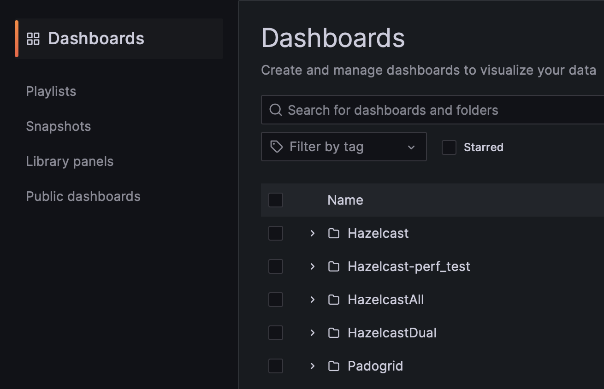
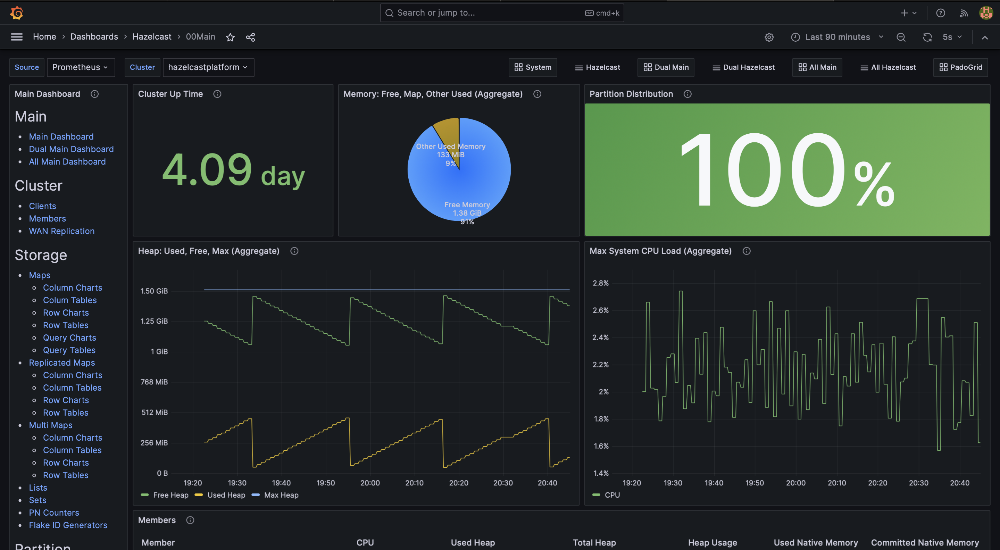

# Hazeltest
Welcome, fellow Hazelcast warrior! If you're looking at this code repository, it may be so because you've been facing the challenge of testing your Hazelcast clusters, and maybe you've been wondering if there are tools out there making that process a bit easier.

Hazeltest is an application that attempts to achieve just that: By means of simple-to-configure, yet effective and versatile test loops, it stresses a Hazelcast cluster, thus facilitating the discovery of misconfigurations or other errors.

Right now, the application is still in a very early phase of development, but because I'm using it as a real-world project for learning Golang -- and because I actually do face the challenge of testing Hazelcast clusters in a project I currently work in --, you can expect more features to be added in the upcoming weeks.

For a general overview of the background and ideas behind Hazeltest, please refer to the introductory blog post I've written, which you can find [here](https://nicokrieg.com/hazeltest-introduction.html).

## Getting Started
Have a Kubernetes cluster at your disposal? Then you're in luck, because the easiest and most convenient way to get started is to apply the two Helm charts you can find in this repository's [chart](./resources/charts/) folder to it. First, get yourself a neat little Hazelcast cluster by running the following:

```bash
helm upgrade --install hazelcastwithmancenter ./hazelcastwithmancenter --namespace=hazelcastplatform --create-namespace
```

Once the cluster is up and running, you can install Hazeltest like so:

```bash
helm upgrade --install hazeltest ./hazeltest --namespace=hazelcastplatform
```

In the Hazeltest pod, you should see some logging statements informing about the duration of a bunch of `getMap()` calls the two runners enabled by default have made on the Hazelcast cluster.

## Diving Deeper
The next step you may be inclined to do is to take a closer look at which test runners are currently available in the application and how they can be configured.

### Available Runners
The first runner available today is the `PokedexRunner`, which runs the test loop with the 151 Pokémon of the first-generation Pokédex. It serializes them into a string-based Json structure, which is then saved to Hazelcast. The `PokedexRunner` is not intended to put a lot of data into Hazelcast (i. e., it is not intended to load-test a Hazelcast cluster in terms of its memory), but instead stresses the CPU. The second available runner, on the other hand, is the `LoadRunner`, and as its name indicates, it is designed to "load up" the Hazelcast cluster under test with lots of data such as to test the behavior of the cluster once its maximum storage capacity has been reached. As opposed to the `PokedexRunner`, which is -- by nature of the data it works with -- restricted to 151 elements in each map, the `LoadRunner` can be configured arbitrarily regarding the number of elements it should put into each map, and the elements' size is configurable, too. 

### Configuration
The default configuration resides right with the source code, and you can find it [here](./client/defaultConfig.yaml). It contains all properties currently available for configuring the two aforementioned runners along with comments shortly describing what each property does and what it can be used for.

You can find all properties for configuring the Hazeltest application itself in the [`values.yaml`](./resources/charts/hazeltest/values.yaml) file of the [Hazeltest Helm chart](./resources/charts/hazeltest/) along with comments explaining them.

## Monitoring Your Hazelcast Cluster
Once you deployed Hazeltest so it generates some load on your Hazelcast cluster under test, you might want to start monitoring your Hazelcast cluster in order to get a more thorough understanding for the sort of load Hazeltest creates and how your cluster's members can deal with that load. In case you have deployed Hazelcast to a Kubernetes cluster, you may find the small monitoring stack this repository offers useful. In short, it utilizes the following components:

* Prometheus for scraping the Pods of your Hazelcast cluster (or clusters)
* Grafana dashboards for visualizing the metrics scraped by Prometheus 
* Grafana itself

The latter two are offered by the [`padogrid-grafana`](https://hub.docker.com/r/antsinmyey3sjohnson/padogrid-grafana) image, which itself is based on a [`padogrid`](https://hub.docker.com/r/padogrid/padogrid) image. (In case you're wondering what PadoGrid is and how it can help you, there's a short introduction down below.)

<div style="border-left: 4px solid orange; padding: 10px; margin-bottom: 10px">
    <strong>Note:</strong> Only the enterprise version of Hazelcast offers the <i>com_hazelcast</i> metrics the Grafana dashboards that come bundled with PadoGrid rely on. If you wish to use the monitoring stack available in this repository, you can request a free trial license <a href="https://hazelcast.com/get-started/">here</a> if you don't currently have one.
</div>

### Installing Hazelcast Enterprise
The [Helm chart](./resources/charts/hazelcastwithmancenter/) included in this repository for installing Hazelcast can be configured to use Hazelcast Enterprise rather than the community edition. The following properties in the [`values.yaml`](./resources/charts/hazelcastwithmancenter/values.yaml) file are important in this context:

* `.Values.platform.cluster.members.edition.enterprise.enable`: Whether to enable using the Enterprise edition. If set so `true`, the chart expects a Kubernetes Secret that contains the enterprise license key, see below.
* `.Values.platform.cluster.members.edition.enterprise.image`: The Hazelcast Enterprise image to use.
* `.Values.platform.cluster.members.edition.enterprise.license.secretName`: The name of the Kubernetes Secret that contains the enterprise license key. 
* `.Values.platform.cluster.members.edition.enterprise.license.keyPath`: The path, within the secret, to the key that holds the enterprise license key as a string.

<div style="border-left: 4px solid orange; padding: 10px; margin-bottom: 10px">
    <strong>Note:</strong> The Secret containing the Hazelcast Enterprise license and the Hazelcast Enterprise cluster must reside the in the same namespace.
</div>

For example, assuming you would like to use the image for Hazelcast Enterprise 5.3.6 and your license key sits in a Secret called `hazelcast-enterprise-license` that represent the license key string a in a property called `data.licenseKey`, you would configure the properties above like so:

```yaml
platform:
  # ...
  cluster:
    # ...
    members:
      # ...
      edition:
        enterprise:
          enable: true
          image: hazelcast/hazelcast-enterprise:5.3.6
          license:
            secretName: hazelcast-enterprise-license
            keyPath: licenseKey
```

You can then deploy your Hazelcast Enterprise cluster using just the same command you may have already encountered in the _Getting Started_ section above (assuming you're in the [`resources/charts`](./resources/charts/) directory of your local copy of this repository):

```bash
helm upgrade --install hazelcastwithmancenter ./hazelcastwithmancenter --namespace=hazelcastplatform --create-namespace
```

### Installing Prometheus
Once your Hazelcast Enterprise cluster is up and running, it's time to scrape some metrics! To do so, you can install Prometheus using the following command:

```bash
helm upgrade --install prometheus ./prometheus -n prometheus --create-namespace
```

(You can modify the Prometheus configuration in the chart's [`values.yaml`](./resources/charts/prometheus/values.yaml) file if you so desire, of course, but the properties already provided there should work out of the box.)

You can check whether the _com_hazelcast_ metrics are scraped correctly by navigating to Prometheus' web UI. The URL for doing so corresponds to the following pattern: `http://<external ip of prometheus loadbalancer service>:9090`

### Installing `padogrid-grafana`
The last puzzle piece in this small monitoring stack is the [`padogrid-grafana`](https://hub.docker.com/r/antsinmyey3sjohnson/padogrid-grafana) image that comes bundled both with Grafana and some really sweet dashboards for monitoring Hazelcast (more precisely speaking, the image's base image, [`padogrid`](https://hub.docker.com/r/padogrid/padogrid), offers all the dashboards, and `padogrid-grafana` merely adds Grafana and performs some work to get Grafana configured and running when deployed in a Helm chart). 

The `padogrid-grafana` installation must be pointed to the Prometheus server that scrapes the _com_hazelcast_ metrics from your Hazelcast cluster's members. In case you installed Prometheus according to the instructions above without having modified the chart, the `padogridwithgrafana` chart will work out of the box, too. In case you have modified either the name of the Kubernetes Service that points to your Prometheus Pod, the namespace, or the port, please make sure to adjust the `PADO_MONITORING_PROMETHEUS_URL` property beneath the `padogridWithGrafana.config.padoEnv` object in the chart's [`values.yaml`](./resources/charts/padogridwithgrafana/values.yaml) file accordingly.

You can install the chart like so:

```bash
helm upgrade --install padogridwithgrafana ./padogridwithgrafana --namespace hazelcastplatform
```

### Harvesting The Fruits
Finally, you'll probably want to get some monitoring done using this freshly installed monitoring stack. To do so, visit the Grafana web UI and navigate to the _Dashboards_ page:

```
http://<external ip for grafana loadbalancer service>:3000/dashboards
```

<div style="border-left: 4px solid orange; padding: 10px; margin-bottom: 10px">
    <strong>Note:</strong> If this is your first login to Grafana, you can log in using Grafana's default username/password combination, which, at the time of this writing, is <i>admin/admin</i>. Of course, it is recommended to change this to something more secure once Grafana prompts you to do so.
</div>

Here, the available dashboards are categorized into multiple folders:



A good place to start is the _00Main_ dashboard in the _Hazelcast_ folder. Wih a very small Hazelcast cluster, it might look something like the following:



This should give you a good overview of how your Hazelcast cluster is currently doing, and more detailed views are available via the links on the left-hand side of the dashboard. In fact, there is quite a lot to discover, so feel free to dig in and have fun exploring!

## Generating Load With PadoGrid
TODO: Write this section.

