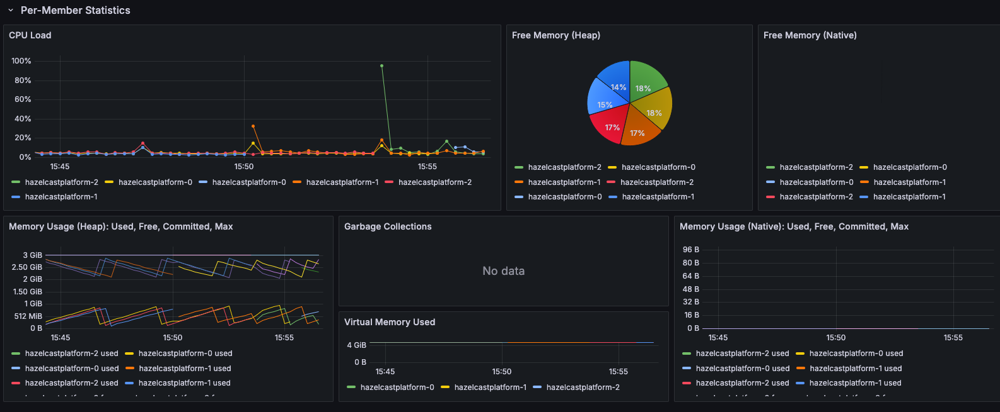

# Hazeltest

Welcome, fellow Hazelcast warrior! Maybe you're taking a look at this repository because you've been facing the
challenge of load-testing your Hazelcast clusters, and perhaps you've been wondering whether there are tools out there
in the depths of this thing called the _Internet_ that can support you on this journey.

## Application Purpose

Short disclaimer: If you're more the visual type of person and would much rather digest a video than read text, then the [introduction video for Hazeltest](https://youtu.be/GojMTeDzdsk?si=xh-6P6Vk15UdjWCb) might be for you!

On the other hand, in case you like _reading_ stuff -- you know, how our grandfathers did --, then... well, read on.

Hazeltest is a small application whose purpose is to support Hazelcast operation engineers in load-testing the Hazelcast clusters described by their release candidates (where the _release candidate_ is the package bundling the Hazelcast Platform executable plus all configuration to make it fly that might eventually make it to production, such as a Helm chart). Along those lines, the application offers simple-to-configure, yet effective and versatile runners you can utilize to create load on the Hazelcast cluster under test, so errors such as misconfigurations make themselves known in a safe testing environment -- that is, _long before the release candidate describing this cluster makes its way to production_, where such errors could wreak all kinds of havoc!

Keep in mind that you don't really have a choice _if_ your Hazelcast clusters will be load-tested; you can only choose _when_ -- after all, in the absence of any kind of formal load-testing prior to shipping a release candidate to production, it's the production environment itself that will necessarily conduct the first load test, as it will be the first stage in which the release candidate -- now actually released -- gets exposed to load, which it must then handle. So, if load testing is necessarily performed anyway, then why not adjust the _when_ bit to a point in the release cycle in which the release candidate can be load-tested to your heart's content in a safe environment, such as a dedicated load-testing environment? 

Even if running an exhaustive and thorough load test on a Hazelcast cluster does not make misconfigurations manifest, it may still uncover potential for improvement in terms of the members' performance, which you can then address prior to shipping the release candidate in question to production. And in case neither errors nor improvement potentials make themselves known, then, well, you've got proof that your release candidate is ready to go, and you brought about that proof long before the release candidate actually got shipped to production! (In my humble opinion, bringing that proof _before_ rolling out the thing to production just makes for so much better sleep at night, specifically when your Hazelcast clusters run mission-critical workloads.)

In short, Hazeltest (currently) offers...

* ... two map runners along with two test loops to create load on Hazelcast maps
* ... two queue runners with a single test loop to create load on Hazelcast queues
* ... a chaos monkey to purposefully kill Hazelcast members in order to measure their configuration's appropriateness in terms of handling such error scenarios
* ... a status endpoint to query for test progress as a foundation for building automation on top of Hazeltest

Hazeltest is under active development, so it's likely this feature list will expand quite a bit in the
future!

Interested in a more elaborate overview of the background and ideas behind Hazeltest? Then you might find the [introductory blog post](https://nicokrieg.com/hazeltest-introduction.html) I've written on precisely this matter helpful.

I've also been working on some videos explaining the idea of and concepts embedded in Hazeltest, which you can find on the [Hazeltest channel over on YouTube](https://www.youtube.com/@hazeltest) (in case you watched the introduction video linked to above, you may have already discovered the other videos, too).

## Getting Started

The following paragraphs will help you get started quickly with performing the first load test using Hazeltest, while more in-depth information awaits you further down the line (to answer questions such as _What's a test loop as opposed to a runner, and how do I configure them?_, _What information does the status endpoint provide, and how could I build automation on top of it?_, and _What are some common flaws in a Hazelcast configuration I should be cautious of?_).

If you have a Kubernetes cluster at your disposal, you're in luck, because the easiest and most convenient way to get started is to apply the various Helm charts you can find in this repository's [`charts`](./resources/charts/) folder to it (bonus luck points if the Kubernetes cluster in question has some juice in terms of CPU and memory, because that just makes everything so much more interesting!).

> :warning: **Note:** The various Helm charts you're going to install in scope of this section will spawn Pods that require a certain amount of resources (in terms of CPU and memory) on the target Kubernetes cluster (obviously -- d'uh). I configured the resource requests and limits such that all workloads are runnable on a single-node cluster with 6 CPUs and 20 GBs of RAM, assuming a lightweight Kubernetes flavor such as k3s. However, the workloads' resource requests and limits might not be optimally suited for your environment, so please feel free to adjust as needed.

### Installing Hazelcast

First, you can spawn a small Hazelcast cluster by invoking the following command (assuming, as will all ensuing commands, you're in the `resources/charts` folder of your locally cloned version of this repository):

```bash
helm upgrade --install hazelcastwithmancenter ./hazelcastwithmancenter --namespace=hazelcastplatform --create-namespace
```

If you left the Helm chart in question unmodified, this will bring up a three-node Hazelcast cluster plus a tiny Management Center instance. By default, the latter is exposed via a `NodePort`-type Service on port `30080`, so in case you want to check out the Management Center's UI, simply visit `http://<ip-of-an-arbitrary-node-in-your-kubernetes-cluster>:30080` in your browser. 

You can retrieve the IP of one of the nodes in your Kubernetes cluster with a command like the following:

```bash
k get nodes -o jsonpath='{.items[0].status.addresses[?(@.type=="InternalIP")].address}'; echo
```

... where `k` is an alias for `kubectl`, because typing the latter a million times a day when working with Kubernetes gets old real fast.

### Installing Hazeltest

Once the Hazelcast cluster is up and running -- and you have, optionally, brought up the Management Center's UI in your browser --, you can install Hazeltest like so:

```bash
helm upgrade --install hazeltest ./hazeltest --namespace=hazelcastplatform
```

 The Hazeltest Pod's logs will inform about the various actions the application's Map Runners and Queue Runners are performing, such as:

 * `starting operation chain of length 3000 for map '<some map>' on goroutine <z>`
 * `using upper boundary <x> and lower boundary <y> for map '<some map>' on goroutine <z>`
 * `finished <x> of <y> put runs for queue '<some queue>' in queue goroutine <z>`

 ... all neatly formatted in JSON for improved machine-based processing (log aggregation platforms like Splunk, for example, are excellent at working with JSON!) and along with quite a bit of meta information, but you get the idea.

 (In case you're wondering right now what the heck "Map Runners" and "Queue Runners" are -- don't worry! We'll dive into these concepts further down below.)

 > :warning: **Note:** By default, this chart launches a single Hazeltest instance whose Chaos Monkey feature is enabled, so worry not if you suddenly observe Hazelcast members getting terminated and restarting -- in this case, that's actually intended!

 ### Installing Prometheus

Isn't running any kind of load test so much more fun when you can watch some dashboard panels go wild as soon as the test starts doing its thing? Well, the Grafana chart you can find in this repository's charts folder comes with some nice dashboards, but they are of no use whatsoever without the delivery of corresponding metrics. 

The Hazelcast members you brought up earlier are configured to expose metrics to Prometheus (or any kind of technology able to scrape them, really), so let's get ourselves a Prometheus instance to perform the scraping:

```bash
helm upgrade --install prometheus ./prometheus -n monitoring --create-namespace
```

Note that this Prometheus instance is super simple -- it writes any metrics gathered to the Pod filesystem, for example, so as soon as the Pod's gone, so are the metrics. (Which is exactly what we want in a simple demo setup so as to save ourselves the hassle of setting up proper persistence and running clean-up jobs afterwards, but don't use this for production, obviously.)

By default, the Prometheus chart, too, exposes its workload by means of a `NodePort`-type Service, albeit this time on port `30090`. If you feel so inclined, therefore, you can once again fire up your browser and directly access Prometheus' UI, but without some queries to run, there won't be much to see. Luckily, you won't have to type out and then manually run said queries -- the dashboards bundled with the Grafana Helm chart you're about to install will do that for you.

### Installing Grafana

We've established above that load testing is a lot more fun if you can watch the effects of the tests unfold on a couple of nice dashboards, but there are no such dashboards in sight yet. Let's change that!

The following command will bring up a small Grafana instance to visualize the metrics exposed by Hazelcast and scraped by Prometheus:

```bash
helm upgrade --install grafana ./grafana -n monitoring
```

The Grafana chart you just installed is a slightly altered version of the [official Grafana chart](https://github.com/grafana/helm-charts/tree/main/charts/grafana) that comes bundled with a couple of dashboards and pre-configured so the Grafana Pod doesn't use any kind of persistence (as that would increase the complexity of the setup, rendering it less viable for a simple "Getting Started" guide such as this one) and is easily accessible from outside. By default, Grafana's UI is accessible by means of a `NodePort`-type Service on port `30300`. Bring up said UI by pointing your browser to `http://<ip-of-an-arbitrary-node-in-your-kubernetes-cluster>:30300`.

Once the UI asks you to authenticate, use `admin` as the username and the password retrieved by the following command:

```bash
k get secret --namespace monitoring grafana -o jsonpath="{.data.admin-password}" | base64 --decode; echo
```

### Harvesting The Fruits
After having successfully launched a small Hazelcast/Hazeltest stack plus a super simple monitoring stack on top, let's harvest the fruits of our work by investigating the aforementioned dashboards!

Unsurprisingly, they await you in the dashboard section's _Hazelcast_ folder:


By now, your Hazelcast/Hazeltest stack should have been running for at least a couple of minutes, so all dashboards should display quite a bit of interesting information. For example, the `System Overview` dashboard might look something like the following:




Here, the little spikes you can see are hints of terminated and then newly joined Hazelcast members, which are the results of the workings of Hazeltest's aforementioned Chaos Monkey.

At the time of this writing, Hazeltest comes with actors to create load on Hazelcast maps and queues (in the form of the aforementioned Map and Queue Runners, respectively), so it makes sense there are dashboards for these two kinds of data structures. The _Maps_ dashboard might look like this on your end if your Hazelcast/Hazeltest stack has been running for some time:


Similarly, the _Queues_ dashboard may appear like so:


These dashboards give rough indications for how Hazeltest's Map Runners and Queue Runners work (how they work as a result of the configuration encapsulated in the previously installed Hazeltest Helm chart, anyway), so in the next section, we're going to take a closer look at those runners and a concept called "Test Loops", but a little bit of ground-laying work is required first.

### Running Hazeltest Outside of Kubernetes
The Hazeltest Helm chart available in this repository is useful in the sense that it conveniently hides all the details of configuration necessary to connect Hazeltest to a target Hazelcast cluster at startup, but if you've come to this section, it's likely you'll want to know how to connect to a Hazelcast cluster from outside of Kubernetes (or without any involvement of Kubernetes whatsoever, really). 

Well, you're in luck! You can either read on here, or in case you're more the audio/visual type, you may find the following video on my channel enlightening:

[How To Hazeltest 1: Connecting To A Hazelcast Cluster](https://youtu.be/-c5XPT4-daw?si=cmsLt13F3mXgnTca)

On the other hand, read on if you prefer reading some good ol' text.

__Mandatory Properties__

There are two things you have to tell Hazeltest if you want it to connect to a Hazelcast cluster: the cluster's name, and at least one endpoint to connect to. Both of these parameters are injectable via environment variables:

* ``HZ_CLUSTER``: Specifies the name of the target Hazelcast cluster (i.e. the string you specified on Hazelcast's side using the `hazelcast.cluster-name` property). For example, the Hazelcast Helm chart contained in this repository by default sets ``cluster-name`` to ``hazelcastplatform`` and, correspondingly, the Helm chart for Hazeltest sets ``HZ_CLUSTER`` to the same value.
* ``HZ_MEMBERS``: Although this can be a comma-separated list of members to connect to, in most cases, providing a single member -- or an endpoint pointing to at least one member, such as a loadbalancer host name -- is completely sufficient, as the all-member routing mode (also known as "smart routing") enabled by default in the Hazelcast Golang client used by Hazeltest will figure out the remaining members on its own and automatically connect to them, too, assuming they're on the same network and nothing blocks access. For example, if you run a Hazelcast cluster on a couple of VMs and want Hazeltest to load-test its members, specifying ``<host name or IP of one of the VMs>:5701`` should suffice, assuming you exposed the Hazelcast member running on the VM using Hazelcast's default port of ``5701``. (Obviously, if you're running your Hazelcast members on a system in which IPs have limited meaning because they can arbitrarily change -- think of a Pod running in Kubernetes --, you'll be better off using a hostname than an IP.)

__Optional Properties__

Although the following two properties are still important, they aren't mandatory for simply connecting to the target Hazelcast cluster, and because of that, they were modelled as command-line arguments rather than environment variables (you can find an example invocation setting both the former and the latter down below):

* ``-config-file``: Allows you to specify a custom configuration file, thus represents the means through which custom configuration for load creation behavior can be injected. To build your own configuration, I suggest you take the [``defaultConfig.yaml``](./client/defaultConfig.yaml) as a starting point and iteratively adjust configuration as required. Note that Hazeltest will take the default configuration from the aforementioned file for any property not explicitly overridden by means of a custom config file, so you only have to provide those properties in the latter that you wish to override.
* ``-use-unisocket-client``: Enables or disables usage of the uni-socket routing mode on the Hazelcast client. The default is the smart-routing (or all-member routing) mode (i.e. ``-use-unisocket-client=false``), but that mode only makes sense if all members of the target Hazelcast cluster can be reached (the classic example for when this isn't the case is when you're accessing Hazelcast members running on a different network with a loadbalancer acting as a single entrypoint into the set of members; in this case, uni-socket mode will establish and hold a sticky connection to whatever member of the cluster the loadbalancer happened to balance the initial request to).

__Sample Invocation__

So, let's assume you just downloaded the native Hazeltest executable from the [releases tag](https://github.com/AntsInMyEy3sJohnson/hazeltest/releases), you already wrote a custom configuration, and now you want to wreak havoc on an unsuspecting Hazelcast cluster!
 
The following is an example for how you can invoke the Hazeltest executable:

```bash
env HZ_CLUSTER=hazelcastplatform HZ_MEMBERS=192.168.44.129:32571 ./hazeltest-0.16.3-linux-arm64 -config-file=./my-custom-config.yaml -use-unisocket-client=true
```

This makes a couple of assumptions, of course, namely:
* You're on an ARM-based Linux system, so you downloaded `hazeltest-0.16.3-linux-arm64`
* Your Hazelcast cluster is called ``hazelcastplatform``
* There is a loadbalancer with the IP ``192.168.44.129`` whose port `32571` points to at least one Hazelcast member
* You run Hazeltest and the Hazelcast members on two separate networks (or network segments) and therefore have to rely on the sticky TCP connection unisocket client mode establishes to one of the Hazelcast members when initially making the connection via the loadbalancer

These are some assumptions that may or may not be true in your particular setup, so please treat this only as a suggestion, and adjust your invocation as needed.


## Diving Deeper

Interested in learning more about the concepts in Hazeltest whose workings you can observe on your Hazelcast clusters under test? Then look no further than the following sections.

### Underlying Idea
To shortly reiterate the application purposes stated previously, Hazeltest lets you load-test Hazelcast clusters, enabling you to iterate over the release candidates describing those clusters long before any of them gets rolled out to production. In this way, you can spot errors such as misconfigurations and identify improvement potentials for cluster/member performance, and not only address them long before the new release candidate thus created makes it to production, but also create proof that the fixes and improvements actually have the intended effect. Thus, you can establish proof that your release candidates are fit for production _before_ they actually get rolled out to production.

(Side note: If you're from the realm of software development, the idea described above -- you know, asserting production fitness for a given release candidate before deploying the thing to production -- probably appears as natural, and as self-evidently reasonable and useful, as the act of breathing! And that's because, well, it is. But, according to my own experience thus far, the release candidates describing middleware components -- such as databases, message queues, or a certain in-memory data and computing platform -- don't experience nearly the same amount of formalized, standardized testing than self-written code artifact release candidates (which strikes as a surprise given the criticality of the workloads such middleware components often run). It might be subject to wonderful discussion as to why this is the case, but either way, the absence of such testing is brave at best, and can entail catastrophic consequences at worst, hence Hazeltest is my attempt at solving this problem in the realm of Hazelcast.)

### Load Dimensions

Before we dive into how the application achieves the purpose outlined above, we need a framework within which the meaning of load for both the sender (the load-creating actor; here: the actors within Hazeltest) and the receiver (the Hazelcast cluster under test) can be established and then navigated more clearly and explicitly. As a suggestion for such a framework, I'm putting forward "load dimensions". 

Currently, there are six load dimensions (as far as the load Hazeltest can currently create is concerned; there are more dimensions to load a Hazelcast cluster can experience, hence as Hazeltest's feature set will be expanded, so will be the following list):

1. Number of items
2. Item size
3. Number of data structures
4. Number of clients
5. Cluster health
6. Operations per second

For example, a Hazelcast cluster could be under load in terms of these dimensions as follows (using only Hazelcast maps in this example):

1. 8 million items
2. Average size of 1.2 kb, with the largest items being up to 2mb in size
3. Total number of items distributed across 1.200 maps
4. Maps are operated on by 220 clients
5. The cluster is healthy (i.e. no member restarts, no members down due to maintenance, etc.) -- no additional load as a result of, for example, repartitioning operations
6. Across all maps, the members combined experience 5.000 sets, 2.000 puts, 11.000 gets, and 500 removes per second

It's important to classify load along those different dimensions due to the fact that, say, 8 million items in 1.200 maps will create totally different Hazelcast cluster and member usage and performance than, say, 8 million items in one large map, even if the total (net payload) memory consumed is exactly the same in both scenarios.

With a minimal framework for measuring and creating load established, it seems obvious that to fulfil its purpose, Hazeltest has to offer load-creating actors that are able -- not necessarily individually, but at least in combination -- to create load on these six dimensions.

Let's take a look at the load-creating actors available in Hazeltest and how you can get the most out of them.

### Map Runners And Map Test Loops
At the time of this writing, there are two Map Runners available in Hazeltest -- the Pokédex Runner and the Load Runner --, and they can be combined with two types of Test Loop, namely, the Batch Test Loop and the Boundary Test Loop. The relationship between Runners and Test Loops is one of parent-child, i.e. a Runner can use one type of Test Loop.

__Runner vs. Test Loop__

This begs the question, of course: Which component does what? As a rule of thumb, it can be said that Runners offer adjustability for load dimensions, whereas the Test Loop determines the kind and order of operation executed on the target Hazelcast cluster (with the exception of load dimension 6, as both available Test Loops offer adjustability for sleeps, too, which translates to offering adjustability for the number of operations executed per second). In other words, the Runner as the framework around the Test Loop never executes any operations on Hazelcast by itself, but relies on the Test Loop to do so. 

Let's take a look at an example for how to configure the Map Load Runner/Batch Test Loop combination (many properties have been omitted here for brevity):

```yaml
mapTests:
  load:
    enabled: true
    # load dimension 3
    numMaps: 10
    # load dimension 1
    numEntriesPerMap: 50000
    payload:
      # load dimension 2
      fixedSize:
        enabled: true
        sizeBytes: 1200
    # load dimension 3 (impacts how the Runner will form map names, so 
    # translates to more or fewer maps)
    appendMapIndexToMapName: true
    # load dimension 3 (for the same reason)
    appendClientIdToMapName: false
    sleeps:
      # load dimension 6
      betweenRuns:
        enabled: true
        durationMs: 2000
        enableRandomness: true
    testLoop:
      type: batch
      batch:
        # load dimension 6 (only option to influence a load dimension on the 
        # test loop layer -- same goes for boundary test loop, although the latter
        # offers different kinds of sleeps)
        sleeps:
          afterBatchAction:
            enabled: true
            durationMs: 10
            enableRandomness: true
          afterActionBatch:
            enabled: true
            durationMs: 2000
            enableRandomness: true
```

So, with the exception of load dimension 6, adjustability of load dimensions is offered exclusively by the Runner. The Test Loop, on the other hand -- although not explicitly expressed in terms of this declarative configuration, but rather as a result of the logic of the Test Loop itself, as a result of its code -- decides when to execute which kind of operation on the Hazelcast cluster under test.

To drive this point home, consider the following diagrams:


In the diagrams on the left-hand side and on the right-hand side, the Map Load Runner was configured in exactly the same way -- with the exception, as the heading indicates, of the Test Loop; the left half shows the Map Load Runner in combination with the Batch Test Loop, and the right displays the combination with the Boundary Test Loop. As you can see, the load creation outcome on the target Hazelcast cluster's maps varies significantly depending on the choice of Test Loop.

With the Map Runner and Test Loop concepts established and their relationship outlined, let's examine the available Runners and Test Loops more closely.

__The Map Pokédex Runner__

The Pokédex Runner for creating load on maps is where it all started -- the first load creation mechanism in Hazeltest I implemented to observe how quickly the lite (or "compute") members of my client's Hazelcast clusters are able to respond to incoming `getMap` requests with different threading configurations when under high CPU load (the fact that today's Test Loops log the time it takes for their `getMap` calls to complete traces back to this first use case). Requirements for this first load generation mechanism, then, were very simple:

1. Execute `getMap` calls and log time it took to complete each one
2. Keep CPU busy

It's for this reason I chose the first-generation Pokédex (the one you may remember if you had an awesome childhood and/or little interest to pay attention in school) as the basis for the first Runner (which then, obviously, became the "Pokédex Runner") -- a simple dataset with light-weight entries which the first iteration of Runner functionality used to execute batches of operations against the Hazelcast cluster under test. These operation batches -- ingest, read, delete -- could be run very quickly, particularly in combination with the light-weight Pokédex entries, which made for a great tool to keep the CPU busy after having measured the duration of the preceding `getMap` invocations.

(In case you're suspecting now that the first iteration of functionality to run those operation batches eventually got pulled out of the Runner itself and became what's known today as the aforementioned _Batch Test Loop_ -- you're entirely correct! Indeed, the introduction of the Load Runner, see below, necessitated a refactoring of the batch functionality into a dedicated concept with corresponding standalone code, so both resulting Runners could make use of it independently.)

Even in today's version of Hazeltest, if your goal is to simply stress the CPU of the target Hazelcast cluster as much as possible, the Pokédex Runner/Batch Test Loop combination might very much be worth giving a closer look!

The following excerpt shows a possible configuration for the Pokédex Runner (for explanations on those properties, please refer to the [`defaultConfig.yaml` file](./client/defaultConfig.yaml)) in combination with the Batch Test Loop:

```
mapTests:
  pokedex:
    enabled: true
    numMaps: 10
    appendMapIndexToMapName: true
    appendClientIdToMapName: false
    numRuns: 10000
    performPreRunClean:
      errorBehavior: ignore
      cleanAgainThreshold:
        enabled: true
        thresholdMs: 30000
    mapPrefix:
      enabled: true
      prefix: "ht_"
    sleeps:
      betweenRuns:
        enabled: true
        durationMs: 2000
        enableRandomness: true
    testLoop:
      type: batch
      batch:
        sleeps:
          afterBatchAction:
            enabled: true
            durationMs: 50
            enableRandomness: true
          afterActionBatch:
            enabled: true
            durationMs: 5000
            enableRandomness: true
```

You may have spotted the `performPreRunClean` configuration object as hint for a concept in Hazeltest that hasn't been formally introduced yet. Don't worry about it for now, we're going to give this feature its due introduction later on!

__In short__, use the Pokédex Runner if you wish to stress the CPU of the Hazelcast cluster under test.


### Run, Forest, Run

The first runner available today is the `PokedexRunner`, which runs the test loop with the 151 Pokémon of the
first-generation Pokédex. It serializes them into a string-based Json structure, which is then saved to Hazelcast.
The `PokedexRunner` is not intended to put a lot of data into Hazelcast (i. e., it is not intended to load-test a
Hazelcast cluster in terms of its memory), but instead stresses the CPU. The second available runner, on the other hand,
is the `LoadRunner`, and as its name indicates, it is designed to "load up" the Hazelcast cluster under test with lots
of data such as to test the behavior of the cluster once its maximum storage capacity has been reached. As opposed to
the `PokedexRunner`, which is -- by nature of the data it works with -- restricted to 151 elements in each map,
the `LoadRunner` can be configured arbitrarily regarding the number of elements it should put into each map, and the
elements' size is configurable, too.

### Configuration

The default configuration resides right with the source code, and you can find it [here](./client/defaultConfig.yaml).
It contains all properties currently available for configuring the two aforementioned runners along with comments
shortly describing what each property does and what it can be used for.

You can find all properties for configuring the Hazeltest application itself in
the [`values.yaml`](./resources/charts/hazeltest/values.yaml) file of
the [Hazeltest Helm chart](./resources/charts/hazeltest/) along with comments explaining them.

## Monitoring Your Hazelcast Cluster

Once you deployed Hazeltest so it generates some load on your Hazelcast cluster under test, you might want to start
monitoring it in order to get a more thorough understanding for the sort of load Hazeltest creates and how your
cluster's members can deal with that load. In case you have deployed Hazelcast to a Kubernetes cluster, you may find the
small monitoring stack this repository offers useful. In short, it utilizes the following components:

* Prometheus for scraping the Pods of your Hazelcast cluster (or clusters)
* Grafana dashboards for visualizing the metrics scraped by Prometheus
* Grafana itself

The latter two are provided by the [`padogrid-hazelmon`](https://hub.docker.com/r/antsinmyey3sjohnson/padogrid-hazelmon)
image, which itself is based on a [`padogrid`](https://hub.docker.com/r/padogrid/padogrid) image. (In case you're
wondering what PadoGrid is and how it can help you, there's a short introduction down below.)

### Installing Hazelcast

To make the monitoring stack work, both the Community and Enterprise edition of Hazelcast will do fine, as both offer
the _com_hazelcast_ metrics the Grafana dashboards rely on. In case you would still like to use the Enterprise version
using the chart provided in this repository, check out the [_Installing Hazelcast
Enterprise_](#installing-hazelcast-enterprise) section down below.

You can deploy the Hazelcast cluster to be monitored using the same old Helm command you may have already encountered in
the [_Getting Started_](#getting-started) section above (assuming you're in
the [`resources/charts`](./resources/charts/) directory of your local copy of this repository):

```bash
helm upgrade --install hazelcastwithmancenter ./hazelcastwithmancenter --namespace=hazelcastplatform --create-namespace
```

### Installing Prometheus

Once your Hazelcast cluster is up and running, it's time to scrape some metrics! To do so, you can install Prometheus
using the following command:

```bash
helm upgrade --install prometheus ./prometheus --namespace prometheus --create-namespace
```

(You can modify the Prometheus configuration in the chart's [`values.yaml`](./resources/charts/prometheus/values.yaml)
file if you so desire, of course, but the properties already provided there should work out of the box.)

You can check whether the _com_hazelcast_ metrics are scraped correctly by navigating to Prometheus' web UI. The URL for
doing so corresponds to the following pattern: `http://<external ip of prometheus loadbalancer service>:9090`

### Installing `padogrid-hazelmon`

The last puzzle piece in this small monitoring stack is
the [`padogrid-hazelmon`](https://hub.docker.com/r/antsinmyey3sjohnson/padogrid-hazelmon) image that comes bundled both
with Grafana and some really sweet dashboards for monitoring Hazelcast (more precisely speaking, the image's base
image, [`padogrid`](https://hub.docker.com/r/padogrid/padogrid), offers all the dashboards, and `padogrid-hazelmon`
merely adds Grafana and performs some work to get Grafana configured and running when deployed in a Helm chart).

The `padogrid-hazelmon` installation must be pointed to the Prometheus server that scrapes the _com_hazelcast_ metrics
from your Hazelcast cluster's members. In case you installed Prometheus according to the instructions above without
having modified the chart, the `padogridwithgrafana` chart will work out of the box, too. In case you have modified
either the name of the Kubernetes Service that points to your Prometheus Pod, the namespace, or the port, please make
sure to adjust the `PADO_MONITORING_PROMETHEUS_URL` property beneath the `padogridWithGrafana.config.padoEnv` object in
the chart's [`values.yaml`](./resources/charts/padogridwithgrafana/values.yaml) file accordingly.

You can install the chart like so:

```bash
helm upgrade --install padogridwithgrafana ./padogridwithgrafana --namespace hazelcastplatform
```

### Harvesting The Fruits

Finally, you'll probably want to get some monitoring done using this freshly installed monitoring stack. To do so, visit
the Grafana web UI and navigate to the _Dashboards_ page:

```
http://<external ip for grafana loadbalancer service>:3000/dashboards
```

> :warning: **Note:** If this is your first login to Grafana, you can log in using Grafana's default username/password
> combination, which, at the time of this writing, is _admin/admin_. Of course, it is recommended to change this to
> something more secure once Grafana prompts you to do so.

Here, the available dashboards are categorized into multiple folders:


A good place to start is the _00Main_ dashboard in the _Hazelcast_ folder. Wih a very small Hazelcast cluster, it might
look something like the following:


This should give you a good overview of how your Hazelcast cluster is currently doing, and more detailed views are
available via the links on the left-hand side of the dashboard. In fact, there is quite a lot to discover, so feel free
to dig in and have fun exploring!

## Installing Hazelcast Enterprise

In case you would like to install Hazelcast in the Enterprise edition using the chart offered in this repository, you
may find the following notes useful.

The [Helm chart](./resources/charts/hazelcastwithmancenter/) included in this repository for installing Hazelcast can be
configured to use Hazelcast Enterprise rather than the community edition. The following properties in
the [`values.yaml`](./resources/charts/hazelcastwithmancenter/values.yaml) file are important in this context:

* `.Values.platform.cluster.members.edition.enterprise.enabled`: Whether to enable using the Enterprise edition. If set
  so `true`, the chart expects a Kubernetes Secret that contains the enterprise license key, see below.
* `.Values.platform.cluster.members.edition.enterprise.image`: The Hazelcast Enterprise image to use.
* `.Values.platform.cluster.members.edition.enterprise.license.secretName`: The name of the Kubernetes Secret that
  contains the enterprise license key.
* `.Values.platform.cluster.members.edition.enterprise.license.keyPath`: The path, within the secret, to the key that
  holds the enterprise license key as a string.

> :warning: **Note:** The Hazelcast Enterprise cluster must be deployed to the same namespace that holds the Secret
> containing the license key.

For example, assuming you would like to use the image for Hazelcast Enterprise 5.3.6 and your license key sits in a
Secret called `hazelcast-enterprise-license` that represents the license key string a in a property
called `data.licenseKey`, you would configure the properties above like so:

```yaml
platform:
  # ...
  cluster:
    # ...
    members:
      # ...
      edition:
        enterprise:
          enable: true
          image: hazelcast/hazelcast-enterprise:5.3.6
          license:
            secretName: hazelcast-enterprise-license
            keyPath: licenseKey
```

Then, you can install your Hazelcast cluster using the very same Helm command that, by now, is probably familiar:

```bash
helm upgrade --install hazelcastwithmancenter ./hazelcastwithmancenter --namespace=hazelcastplatform --create-namespace
```

## Generating Load With PadoGrid

_PadoGrid_ is an open source application that provides a fantastic playing ground for testing all kinds of data grid and
computing technologies (Hazelcast is one of them, but since it's based on what the developer calls _distributed
workspaces_ and pluggable _bundles_, it also works with other technologies like Spark, Kafka, and Hadoop).

There are different sub-programs available in PadoGrid, one of which is the [
_perf_test_ application for Hazelcast](https://github.com/padogrid/padogrid/wiki/Hazelcast-perf_test-App). This handy
tool offers the capability of running tests that can be configured by means of text-based properties files that describe
the groups and operations to run in scope of a test. If your goal is to load-test your Hazelcast cluster in terms of
memory and CPU only (rather than CPU and memory plus the number of maps and clients), then PadoGrid will perfectly suit
your needs.

On top of that, the most recent versions of PadoGrid (starting with v0.9.30) also contain super useful dashboards for
monitoring Hazelcast clusters, and the `padogrid-hazelmon` image you may have encountered if you set up Hazeltest's
monitoring stack according to the instructions above leverages them in a running Grafana instance you can access and use
without much prior configuration work.

You can find PadoGrid's source code and many useful guides for getting started over
on [GitHub](https://github.com/padogrid/padogrid).

## More text to potentially include later on

Designed to run on Kubernetes (but by this design by no means limited to running there), the application embodies an
important Kubernetes design philosophy: to formulate desired target state declaratively and in a format easy to
understand and reason about by engineers (granted, it may be subject to wonderful discussion whether Yaml is actually
easy to read assuming a sufficiently large file -- or whether Yaml is something humanity was in need of in the first
place --, but that's beside the point). While _desired target state_ is hard to capture in terms of application
configuration if what the application does is create load on a Hazelcast cluster, Hazeltest still lets you define
declaratively what you want its actors to do -- i.e., what load you want them to create -- by means of
easy-to-reason-about Yaml files.

This reveals another purpose of Hazeltest besides offering the means to perform effective, automated Hazelcast
load-testing: to ensure _repeatability_ of those tests. Repeatability is crucial, for example, when you're adjusting
Hazelcast configuration and want to measure the impact on performance of your adjustments, or when you wish to assess
the performance of a new Hazelcast version compared to an older one. Need to examine how performance changes when you
swap out the Hazelcast JVM's Garbage Collector (say, G1GC vs. ZGC)? Want to know how halving the batch size of a WAN
replication publisher affects replication latency? Or how about simply checking whether your memory configuration is
sane? Only automated load tests with good repeatability will help you get meaningful results quickly and reliably! With
Hazeltest, you can check in Yaml load configs to version control and 